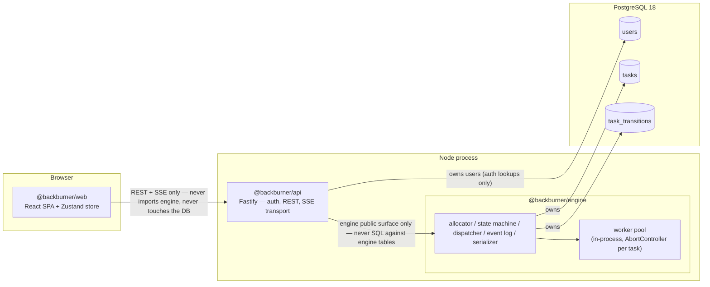
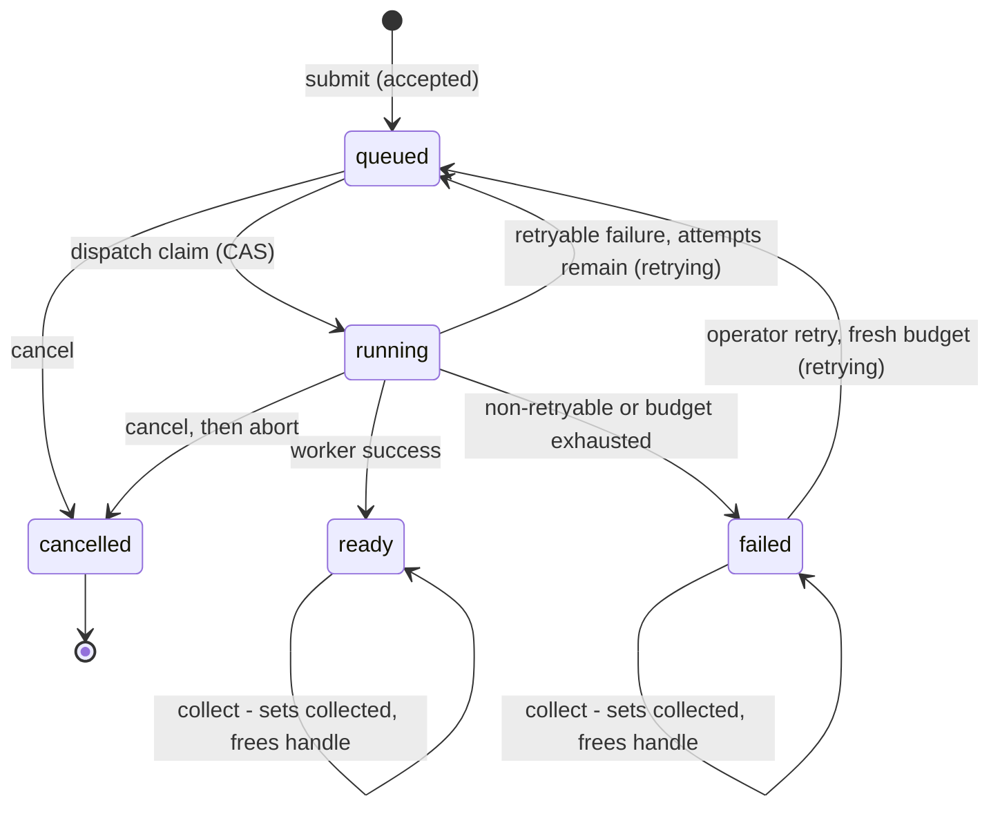
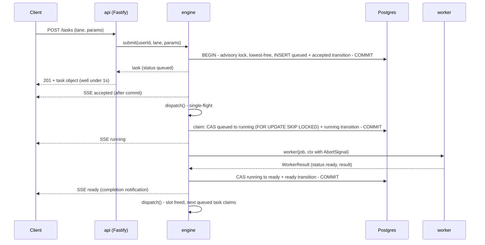
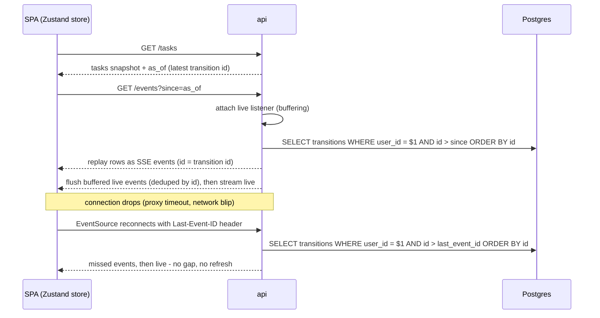

# BackBurner — Architecture

BackBurner is a small background job runner in the spirit of Sidekiq or Temporal: a user submits a job, gets a short handle back immediately, and the engine runs the work in the background under a concurrency limit while a dashboard watches it live. This document is the system design — it is normative for the implementation. The assessment brief it satisfies lives at [`docs/assessment-background-job-runner.pdf`](./assessment-background-job-runner.pdf).

## 1. Overview

The system is three packages around one database:

- **`@backburner/engine`** — the orchestration core: handle allocation, the task state machine, dispatch, the worker pool, retries, recovery, and the event log. It owns the `tasks` and `task_transitions` tables and has **no HTTP dependencies**.
- **`@backburner/api`** — a Fastify server that authenticates requests, translates REST + SSE into calls on the engine's public surface, and serves the built SPA in production. It owns the `users` table.
- **`@backburner/web`** — a React SPA that is a **pure API consumer**: it never imports engine code and never touches the database.

The design optimizes for three properties, in the order the spec evaluates them:

1. **Correctness under concurrency.** Every invariant that matters — one active holder per handle, no invalid state transition, no over-claimed worker slot — is enforced by the database (partial unique index, compare-and-swap updates, advisory locks, `FOR UPDATE SKIP LOCKED`), not by in-process discipline. Races lose at commit time, structurally.
2. **Durability.** All state lives in PostgreSQL. Every transition is journaled in the same transaction that changes state, so a `SIGKILL` at any instant leaves a database that the boot recovery path can reason about completely. Live events are replayable from the journal; nothing depends on process memory surviving.
3. **Clean module boundary.** The engine is a standalone module you could lift into another host. The API is a thin adapter; the frontend could be deleted and the engine would still be fully exercisable over REST.

## 2. System diagram



Boundary rules, stated as law:

| Rule | Enforced how |
|---|---|
| `web` talks to the system only via REST + SSE | No `@backburner/engine` or `pg` dependency in `packages/web` |
| `api` reaches engine state only through the engine's exported functions | `api` has no SQL that mentions `tasks` or `task_transitions` |
| `api` owns `users` and may query it directly | A small, isolated db module in `api`, used for auth only |
| `engine` never imports HTTP machinery | `packages/engine` depends on `pg` and nothing web-facing |

The engine's public surface — the only thing `api` may import:

```ts
createEngine({ pool | connectionString, concurrency, lanes, backoff? }) => {
  start(), stop({ drain? }),
  submit(userId, lane, params, { maxAttempts? }),
  list(userId, filters), counts(userId, filters), get(userId, { handle } | { id }),
  collect(userId, handle), cancel(userId, handle), retry(userId, handle),
  history(userId, taskId),
  subscribe(userId, sinceId?) => AsyncIterable, latestEventId(userId)
}
```

The option and return types the api relies on are pinned:

- **`lanes`** — `Record<string, { worker: Worker; defaults?: { maxAttempts?: number } }>`, with `Worker` per the worker contract in §8. The record's keys are the registered lane names; submitting to any other lane raises `UnknownLaneError`.
- **`backoff`** — `{ baseMs?: number; rng?: () => number }`. Retry delay is `baseMs * 2^(attempts-1) * (0.75 + 0.5 * rng())` — the ±25% jitter of §9 with the RNG injectable, so tests can pin its extremes instead of asserting on randomness ([test-plan §6](./test-plan.md#6-engine-unit-tests)).
- **`subscribe(userId, sinceId?)`** — yields `{ id: number, event: <serialized event object> }`. The api needs both halves: `id` becomes the SSE `id:` line, `event` becomes the `data:` JSON payload.
- **`counts(userId, filters)`** — takes the same `filters` object as `list`, returns `{ all, matching, uncollected, status, lane, lanes }` for the `GET /tasks` envelope's `counts` field. Each number has its own filter basis and `lanes` reports the *registered* lane names in registration order, so it is engine configuration rather than a query over `tasks`; the per-field semantics are normative in [api-contract §6.2](./api-contract.md#62-get-tasks--spec) ([ADR 0018](./decisions/0018-task-counts-on-list-response.md)).

Two rules complete the boundary:

- **The engine never reads `process.env`.** The api entrypoint reads the configuration table (§13) and passes explicit options to `createEngine`; the engine is configured entirely by its caller.
- **`submit`/`get`/`list`/`collect`/`cancel`/`retry` return spec-shaped serialized task objects.** The serializer is an engine module on the public surface, and the api only adds transport — routing, status codes, error envelopes — never reshaping task data.

Engine errors are typed and map 1:1 to HTTP statuses: `UnknownLaneError → 400`, `ValidationError → 400`, `NotFoundError → 404`, `InvalidStateError → 409` (carries the current status).

## 3. Repository layout

npm workspaces monorepo:

```
BackBurner/
├── package.json              # workspaces root; cross-platform npm scripts (no bash-isms)
├── docker-compose.yml        # app + postgres:18 (dev and prod profiles)
├── .devcontainer/            # Codespaces config reusing the compose file
├── .github/workflows/        # CI (unit + e2e against postgres:18 service) and deploy
├── docs/                     # this document, API reference, assessment PDF
├── migrations/               # numbered .sql files — single shared migration stream
├── scripts/
│   └── migrate.mjs           # tiny cross-platform runner; tracks schema_migrations; idempotent
└── packages/
    ├── engine/               # @backburner/engine — orchestration core (pg + SQL, no HTTP)
    ├── api/                  # @backburner/api  — Fastify REST + SSE; serves built SPA in prod
    ├── web/                  # @backburner/web  — React 18 + Vite SPA, Zustand store
    └── e2e/                  # @backburner/e2e  — black-box criteria suite (spawns the real api)
```

Responsibilities and allowed dependency directions:

| Package | Responsibility | May depend on |
|---|---|---|
| `engine` | Tasks, transitions, allocation, dispatch, workers, recovery, events, serialization, seed module | `pg` only |
| `api` | Auth (`users`), routes, validation, SSE transport, static SPA — wires the engine serializer's output into responses | `engine` |
| `web` | Dashboard, submit, task detail, notifications | nothing in this repo — `fetch` + `EventSource` |
| `e2e` | The nine success criteria plus supplemental suites, driven over HTTP/SSE only | none of the packages — spawns the built api as a child process |

Migrations live at the root because the schema is one coherent unit (the engine's tables and the api's `users` table share a database and a migration stream), while table *ownership* — who may run SQL against what — is a package-level rule, not a schema-level one.

## 4. Data model

The full schema (PostgreSQL 18 — `uuidv7()` is native):

```sql
CREATE TABLE users (
  id           uuid PRIMARY KEY DEFAULT uuidv7(),
  name         text NOT NULL,
  api_key_hash text NOT NULL UNIQUE,          -- sha256 hex; raw key shown once at seed time
  created_at   timestamptz NOT NULL DEFAULT now()
);

CREATE TABLE tasks (
  id           uuid PRIMARY KEY DEFAULT uuidv7(),
  user_id      uuid NOT NULL REFERENCES users(id),
  lane         text NOT NULL,
  handle_num   int  NOT NULL CHECK (handle_num >= 1),
  params       jsonb NOT NULL DEFAULT '{}',
  status       text NOT NULL CHECK (status IN ('queued','running','ready','failed','cancelled')),
  result       jsonb,
  error        jsonb,                          -- { reason, retryable }
  attempts     int  NOT NULL DEFAULT 0,
  max_attempts int  NOT NULL DEFAULT 3,
  collected    bool NOT NULL DEFAULT false,
  seeded       bool NOT NULL DEFAULT false,
  enqueued_at  timestamptz NOT NULL DEFAULT now(),  -- reset on EVERY entry to queued
  run_after    timestamptz,                         -- backoff; also powers delayed-jobs extension
  started_at   timestamptz,
  created_at   timestamptz NOT NULL DEFAULT now(),
  updated_at   timestamptz NOT NULL DEFAULT now()   -- maintained by app code in each UPDATE
);

CREATE UNIQUE INDEX one_active_handle ON tasks (user_id, lane, handle_num)
  WHERE status IN ('queued','running')
     OR (status IN ('ready','failed') AND NOT collected);

CREATE INDEX dispatch_scan ON tasks (enqueued_at, id) WHERE status = 'queued';
CREATE INDEX tasks_list ON tasks (user_id, created_at DESC);

-- migration 0003 — the two GET /tasks extension filters (ADR 0022).
CREATE INDEX tasks_uncollected ON tasks (user_id, created_at DESC)
  WHERE status IN ('ready','failed') AND collected = false;
CREATE INDEX tasks_handle_search
  ON tasks (user_id, (lower(lane || '-' || handle_num::text)) text_pattern_ops);

CREATE TABLE task_transitions (
  id          bigint GENERATED ALWAYS AS IDENTITY PRIMARY KEY,  -- doubles as SSE event id / cursor
  task_id     uuid NOT NULL REFERENCES tasks(id),
  user_id     uuid NOT NULL,                   -- denormalized for per-user replay
  event_type  text NOT NULL,                   -- accepted|running|ready|failed|cancelled|retrying|collected
  from_status text,
  to_status   text,
  at          timestamptz NOT NULL DEFAULT now(),
  meta        jsonb NOT NULL DEFAULT '{}'
);
CREATE INDEX transitions_by_task ON task_transitions (task_id, id);
CREATE INDEX transitions_by_user ON task_transitions (user_id, id);
```

Commentary:

- **`handle_num` is an integer, never a stored string.** The public handle `scrape-1` is derived at serialization (`lane || '-' || handle_num`). See §5. `tasks_handle_search` indexes that same expression so `?q=` can look a handle up by equality or prefix without materialising a column that could drift from the derived value.
- **`tasks_uncollected` indexes the uncollected predicate itself**, which is both the `counts.uncollected` basis and the `?uncollected=true` filter — one partial index serves the badge and the view it opens (ADR 0022).
- **`enqueued_at` is the dispatch ordering key** and is reset every time a task enters `queued` — at submit, on retryable failure, on operator retry, and on boot re-queue. A retried task therefore rejoins the back of the line rather than jumping it. `dispatch_scan` is a partial index whose columns match the claim query's `ORDER BY enqueued_at, id` exactly.
- **`run_after`** gates dispatch eligibility. It implements retry backoff today and gives a delayed-jobs feature (`run_at`) nearly for free later.
- **`attempts` counts claims, not completions** — it is incremented the moment the dispatcher claims the row (§9).
- **No CHECK constraints tie `result`/`error` to `status`.** The serializer enforces the spec's visibility rule (`result` non-null only when `ready`, `error` non-null only when `failed`); storage is allowed to retain history — e.g. a task re-queued after a retryable failure still carries its last error internally, which is useful operator context, without ever leaking it through the API in the wrong state.
- **`task_transitions` is an append-only journal** with three simultaneous jobs: the per-task state history shown in the dashboard's detail view, the transactional outbox for SSE (§11), and — via its monotonically increasing `id` — the global event cursor for replay. `user_id` is denormalized so per-user replay is a single index scan.
- The lifecycle vocabulary and task-object fields are byte-for-byte from the spec contract; `lane` is the contract's field name and is used everywhere (schema, API, UI).

### Deep dive: `one_active_handle`

```sql
CREATE UNIQUE INDEX one_active_handle ON tasks (user_id, lane, handle_num)
  WHERE status IN ('queued','running')
     OR (status IN ('ready','failed') AND NOT collected);
```

**"Active" is defined once, here.** A task is active — i.e. it *holds* its handle — when it is in-flight (`queued` or `running`) or finished-but-uncollected (`ready` or `failed`, not yet collected). That is precisely the spec's own collision rule, "still queued, running, or finished-but-uncollected," read literally — "finished" spans both terminal outcomes, ready and failed. A handle is released on exactly two events: **collect** or **cancel** — the spec's recycling rule.

Because the index is *partial*, it constrains only active rows. Collected, cancelled, and superseded tasks keep their `handle_num` forever as history — `scrape-1` may appear on a hundred historical rows — but at most **one** row per `(user_id, lane, handle_num)` can satisfy the predicate at any instant.

This makes handle collisions **structurally impossible rather than procedurally avoided**. The allocator (§6) is careful, but even if it were buggy, raced by a concurrent writer, or bypassed entirely, PostgreSQL would reject the second active holder at commit with a unique violation. Correctness does not depend on application code being right; it depends on an index definition being right, and that is checkable by reading eight lines of SQL.

## 5. Identity: UUID vs handle

Every task has two names with different lifetimes:

- **`id` (UUIDv7)** — the immutable primary identity. UUIDv7 is time-ordered, so primary-key index locality follows insertion order and `id` is a stable tiebreaker for any `ORDER BY`. PostgreSQL 18 generates it natively (`DEFAULT uuidv7()`). Everything internal — foreign keys, the transitions journal, the AbortController map, the dashboard's detail links — keys on `id`.
- **`handle` (`scrape-1`)** — a short, human-friendly, **leased and recyclable** alias, derived at serialization from `lane` and `handle_num`. It is never stored as a string, so the stored integer and the rendered handle cannot drift, and renaming/parsing rules live in exactly one place.

The spec's endpoints address tasks by handle; because handles recycle, the repo also exposes documented extension endpoints (`GET /tasks/id/{id}`, `GET /tasks/id/{id}/history`) for stable historical references. Events likewise carry an additive `task_id` field, since a bare recycled handle is ambiguous to correlate.

**Handle resolution** for `{handle}` path parameters:

1. Parse the handle into `(lane, num)` — split on the final hyphen; the suffix must parse as a positive integer, otherwise 404.
2. If an **active** task (per the §4 predicate) holds `(user, lane, num)` — it wins. There can only be one.
3. Otherwise, resolve to the **most recent former holder**: the newest task with that `(user, lane, num)`, ordered `created_at DESC, id DESC`.
4. Otherwise 404.

Rule 3 is deliberate: after collecting `scrape-1`, `GET /tasks/scrape-1` keeps returning that task — idempotent re-reads work — until the handle is actually reused by a new submission.

## 6. Handle allocation

Allocation happens inside the submit transaction:

```sql
BEGIN;

-- 1. Serialize allocators for this (user, lane) only.
SELECT pg_advisory_xact_lock(hashtext($user_id::text), hashtext($lane));

-- 2. Lowest free number among active tasks in this (user, lane).
--    Candidates are 1 plus every successor of a held number; take the
--    smallest candidate not itself held.
SELECT COALESCE(MIN(candidate), 1) AS handle_num FROM (
  SELECT 1 AS candidate
  UNION
  SELECT handle_num + 1 FROM tasks
   WHERE user_id = $1 AND lane = $2 AND <active-predicate>
) c
WHERE NOT EXISTS (
  SELECT 1 FROM tasks t
   WHERE t.user_id = $1 AND t.lane = $2 AND <active-predicate>
     AND t.handle_num = c.candidate
);

-- 3. Insert the task as queued with that number,
--    and its 'accepted' row into task_transitions.

COMMIT;
```

(`<active-predicate>` is the `one_active_handle` predicate verbatim.)

- **Lowest-free semantics:** the smallest positive integer not currently held by an active task in the lane. Collect `scrape-1` while `scrape-2` and `scrape-3` run, and the next submission gets `scrape-1` — gaps are refilled, exactly as the spec's recycling examples require.
- **The advisory lock** (`pg_advisory_xact_lock`, two-int form keyed on hashes of user id and lane) serializes only concurrent submits *for the same user and lane* — different lanes and different users allocate in parallel. It is transaction-scoped, so it releases automatically on commit, rollback, or connection death; there is no unlock bookkeeping to get wrong.
- **The 23505 backstop:** if an insert ever violates `one_active_handle` (which cannot happen while the advisory lock discipline holds, but the index does not care about our discipline), the engine catches the unique violation and retries the allocation, bounded at 3 attempts. Belt and suspenders, in that order.

**Why the database is the allocator.** The obvious alternatives all fail one of the two hardest-checked behaviors:

- *An in-memory counter or free-list* evaporates on restart and must be rebuilt by scanning the table — a second copy of state that can be wrong, precisely during recovery, precisely when correctness matters most. It also breaks the moment a second process starts.
- *A Postgres sequence* is durable and concurrent but can never recycle numbers, which the spec explicitly requires.
- *Computing the number in the database, under a lock, with a unique index as backstop* is restart-safe by construction (there is nothing to rebuild), multi-process-safe by construction (the lock and the index live in the shared database), and needs zero coordination code.

## 7. Lifecycle



The complete transition table — anything not in this table does not happen:

| From | To | Trigger | Event | Side effects |
|---|---|---|---|---|
| — | queued | `POST /tasks` | `accepted` | allocate lowest free handle under advisory lock |
| queued | running | dispatch claim (CAS) | `running`\* | `attempts+1`, `started_at=now()` |
| queued | cancelled | cancel | `cancelled` | handle freed |
| running | ready | worker success | `ready` | store result |
| running | queued | retryable failure, `attempts < max_attempts` | `retrying`\* | `run_after=backoff`, `enqueued_at=now()` |
| running | failed | non-retryable, or budget exhausted | `failed` | store error; handle kept |
| running | cancelled | cancel → `signal.abort()` | `cancelled` | handle freed |
| failed (uncollected) | queued | `POST /tasks/{handle}/retry` (operator) | `retrying`\* | `attempts=0` (fresh budget), `enqueued_at=now()`, `run_after=NULL` |
| failed | failed + collected | `GET /tasks/{handle}/result` | `collected`\* | handle freed |
| ready | ready + collected | `GET /tasks/{handle}/result` | `collected`\* | handle freed |

\* documented extension event types; the four spec event types (`accepted`, `ready`, `failed`, `cancelled`) keep their spec shapes byte-for-byte.

Two notes on the table:

- **Cancel is byte-for-byte spec.** It is legal from `queued` or `running` only — a failed task has already stopped running, so there is nothing left to cancel. The spec's recycling rule ("handles free on collected or cancelled") is satisfied without extension: a failed task's handle frees on collect, the same as a ready task's.
- **Collect is a state change, not a read, and now applies uniformly to both terminal outcomes.** `GET /tasks/{handle}/result` CASes `collected=false → true` from either `ready` or `failed`, frees the handle, and emits `collected`. Re-fetching while the handle still resolves to that task returns 200 idempotently with no new event.

### CAS enforcement

**Every transition is a compare-and-swap.** The generic shape:

```sql
UPDATE tasks
   SET status = '<to>', ..., updated_at = now()
 WHERE id = $1
   AND status = '<expected-from>'          -- and, for collect: AND NOT collected
RETURNING *;
```

Zero rows returned means the task was not in the expected state — someone else transitioned it first — and the operation is **rejected**, never retried into a different transition. The engine raises `InvalidStateError` carrying the actual current status, and the API answers **409** with `{ "error": { "code": "invalid_state", "current_status": "..." } }`. There is no window in which two actors both believe they moved the task: the row's own `status` column is the lock. Invalid moves are structurally impossible, not merely avoided by careful call ordering.

One documented exception: a transition that is legal from **multiple** states — cancel and collect are the two — may use a single CAS with an explicit expected-state *set* (`WHERE status IN (...)`) instead of a single expected status. Zero rows still means rejection with a 409 carrying the actual status. Cancel's set-CAS exists to close a real race: a read-then-CAS cancel reads `queued`, dispatch claims the task to `running` in the gap, and a CAS pinned to `queued` then spuriously 409s a task that was legitimately cancellable the whole time. Collect's set-CAS is simpler — `ready` and `failed` are both terminal, so there is no analogous race, but the same `status IN (...) AND NOT collected` shape lets one code path acknowledge either outcome. With the set-CAS, the decision about which state the task is in and the transition itself are one atomic statement (§10).

The transition journal row is inserted **in the same transaction** as the state UPDATE, so state and history can never disagree (§11).

## 8. Dispatch

Dispatch is **event-driven push**, not polling. One idempotent async function, `dispatch()`, fills free worker slots from the queue. It is invoked:

- after every committed state change (submit, completion, retry, cancel, collect — anything that could create a claimable task or free a slot),
- once on boot, after recovery (§11),
- by a timer scheduled for the earliest future `run_after` (so backoff wake-ups are exact, not poll-quantized),
- whenever a worker promise settles — fulfil, reject, or abort-discard — i.e. whenever the in-process slot count decrements, regardless of whether any state change committed.

The fourth trigger is not redundant with the first. An `AbortError` settlement or a stale-completion discard (§10) frees a slot with **no** committed state change; without a trigger tied to settlement itself, queued work behind that slot could wait indefinitely — at `WORKER_CONCURRENCY=1`, a single cancel mid-run would deadlock the queue.

**Single-flight with a dirty flag.** Only one `dispatch()` body runs at a time (in-process mutex). If a trigger fires while a run is in progress, it sets a dirty flag and returns; the running pass loops again when it finishes. Late triggers are never lost and concurrent passes can never double-fill slots. The loop exits when a pass ends with the flag clean.

While slots are free (`live workers < WORKER_CONCURRENCY`), each pass claims one task per iteration, in its own transaction:

```sql
UPDATE tasks SET status='running', started_at=now(), attempts=attempts+1, updated_at=now()
WHERE id = (
  SELECT id FROM tasks
  WHERE status='queued' AND (run_after IS NULL OR run_after <= now())
  ORDER BY enqueued_at, id
  LIMIT 1
  FOR UPDATE SKIP LOCKED
)
RETURNING *;
```

Commit, broadcast the `running` event, register an `AbortController` in the engine's `Map<taskId, AbortController>`, then start the worker with `(job, { signal, attempt, maxAttempts })` — the `attempt`/`maxAttempts` handed over are the very values this claim just journaled onto the `running` transition, so a worker and the history endpoint can never disagree about which attempt is running ([ADR 0021](./decisions/0021-flaky-outcomes-attempt-context-and-per-lane-durations.md)). Zero rows claimed means the queue is empty (or everything is waiting on `run_after`) and the pass stops. Workers execute; **they never own state** — every state write goes through the engine's CAS transitions, and the worker merely returns a `WorkerResult`.

> [!NOTE]
> **What `FOR UPDATE SKIP LOCKED` buys.** A plain `SELECT ... LIMIT 1` inside two concurrent claim transactions can pick the *same* row; the second transaction then blocks on the first's row lock and, after it commits, updates a row that is no longer `queued`. `FOR UPDATE` takes the row lock at selection time, and `SKIP LOCKED` tells the scan to *skip* any row someone else already holds rather than wait — so two concurrent claimers atomically receive two *different* tasks, with no blocking and no double-claim. A single BackBurner process does not strictly need this (the single-flight mutex already serializes claims in-process), and it costs nothing. But it means the claim query is already correct for N processes pointed at the same database: scaling out becomes a configuration change, not a redesign (§14).

Timing: after each pass, the engine schedules one timer for the earliest `run_after` still in the future among queued tasks, replacing any previous timer. Arming is **skew-safe**: the arming query returns both `min(run_after)` and the database's `now()` in one statement, and the timer delay is their difference plus a small epsilon, with a 25 ms floor on any re-arm delay. This matters because claim eligibility is evaluated by the *database's* clock (`run_after <= now()` in the claim query): computed against the app clock, a timer would fire "on time" locally while the DB still considers the task ineligible, claim nothing, and re-arm in a hot loop whenever the app clock runs ahead of the DB clock. When the timer fires, it just calls `dispatch()`.

The full happy path:



### Workers and the worker contract

The spec fixes the worker contract, reproduced byte-for-byte:

```ts
interface Job { handle: string; lane: string; params: Record<string, unknown>; }
interface WorkerResult {
  status: "ready" | "failed";
  result?: unknown;
  error?: { reason: string; retryable: boolean };
}
type Worker = (job: Job) => Promise<WorkerResult>;
```

BackBurner extends it additively — a documented extension:

```ts
interface WorkerContext {
  signal: AbortSignal;
  attempt: number;      // 1-based attempt number for this claim
  maxAttempts: number;  // the task's attempt budget
}
type Worker = (job: Job, ctx: WorkerContext) => Promise<WorkerResult>;
```

Two things make this a safe extension rather than a contract change:

- **A spec-shaped single-argument worker remains assignable and fully functional.** A function that ignores its second argument is a valid value of the extended type; the extra argument is simply ignored.
- **The `ctx` parameter is forced by the spec's own requirements.** "A running worker must actually stop" when its job is cancelled — the abort signal has to reach the worker somehow, and a second parameter is the smallest possible conduit.

`attempt` and `maxAttempts` were added to the same object on the same terms ([ADR 0021](./decisions/0021-flaky-outcomes-attempt-context-and-per-lane-durations.md)): a worker that must behave differently on a retry cannot otherwise know which attempt it is on, and inventing a number in `params` would be a client-supplied fiction. **They are the values the claim itself computed** — the same `attempts`/`max_attempts` read off the row the claim CAS returned, and the same two numbers written onto that claim's `running` transition `meta`. What the worker is told and what `GET /tasks/id/{id}/history` reports therefore agree by construction, not by coincidence.

Contract semantics beyond the type:

- A thrown non-Abort exception from any worker is a **retryable failure** with the exception message as the reason — a crash is treated as transient until proven otherwise.
- A rejection with `AbortError` means the job was **cancelled**: the result is discarded, and no completion is recorded (§10).
- The lane registry passed to `createEngine` is the `lanes` record of §2 — `Record<string, { worker: Worker; defaults?: { maxAttempts?: number } }>`. Workers plug in by appearing in that record; the engine contains zero lane-specific logic.
- The mock worker backs all five registered lanes (`scrape`, `report`, `convert`, `build`, `test`). It sleeps for `params.duration_ms`, fails retryably on `params.fail`, fails non-retryably on `params.fail_permanent` — the trigger that exercises the spec's "job marked non-retryable" permanent-failure path end-to-end — and fails retryably *while `ctx.attempt <= params.fail_times`*, succeeding after that, which is the flaky-then-recovers path ([ADR 0021](./decisions/0021-flaky-outcomes-attempt-context-and-per-lane-durations.md)). Precedence: `fail_permanent` > `fail` > `fail_times`; with none of them set the job always succeeds. Its omitted-duration behavior is pinned in [api-contract §1](./api-contract.md#1-conventions): a random duration from **the lane's own range** — 3000–15000 ms everywhere except `build`, which uses 20000–90000 ms — is chosen once at submit time and written into the stored `params.duration_ms`, so retries re-run the *same* duration and the task object shows what will actually happen. The range is per-lane; the *mechanism* is unchanged ([ADR 0017](./decisions/0017-mock-params-normalized-by-caller.md)), and neither lane names nor durations appear anywhere in engine-core.

## 9. Retries and failure

**Two failure classes, honestly distinguished.** A worker reports failure by returning `{ status: "failed", error: { reason, retryable } }`; a worker that *throws* a non-Abort exception is treated as a retryable failure with the exception message as the reason. From there:

- **Retryable, budget remaining** (`attempts < max_attempts`) → back to `queued` with `run_after` set by backoff and `enqueued_at=now()`; extension event `retrying` (meta: attempt, max_attempts, reason, run_after). Auto-retry is invisible to the `failed` state.
- **Non-retryable, or budget exhausted** → `failed`, error stored, handle kept. `failed` means exactly one thing: **awaiting an operator**. The engine never auto-retries out of `failed`.

**Backoff:** `delay_ms = BACKOFF_BASE_MS * 2^(attempts - 1)`, with ±25% jitter to decorrelate retries. `BACKOFF_BASE_MS` defaults to 2000 and is env-overridable (tests run at ~100ms).

**Attempts increment at claim time, not at completion** — the claim SQL in §8 does `attempts = attempts + 1` as part of moving to `running`. The consequence is deliberate: a crash mid-run has already consumed an attempt. That is the **poison-pill defense** — a job whose execution kills the process cannot crash-loop the engine forever, because each crash-recovery cycle burns budget until the job parks in `failed` with an honest reason (§11). Systems that count attempts at completion never record the attempt that killed them.

The honest cost: a crash consumes an attempt from **every** task running at that moment, not only from the poison pill — the engine cannot know which of them killed the process, so it charges them all. An innocent long job co-scheduled with a crashing one through repeated restarts can land in `failed` with `"interrupted by restart; attempt budget exhausted"` having never misbehaved, and with `max_attempts: 1` a single unlucky restart permanently fails a healthy job. This is the accepted price of the poison-pill defense; the operator retry's budget reset (below) is the recovery lever for the falsely accused.

**Operator retry** (`POST /tasks/{handle}/retry`, legal only from `failed` and only while uncollected) resets `attempts=0` — a deliberate fresh budget, since the operator has presumably changed something — clears `run_after`, resets `enqueued_at`, and re-queues. Default `max_attempts` is 3, with per-lane defaults and a per-submit override validated to 1–10.

**Honest reasons.** The stored `error.reason` is always the specific truth: the worker's own reason string, a thrown exception's message, or `"interrupted by restart; attempt budget exhausted"` for the recovery path — never a generic `"failed"`. The `retryable` flag is likewise the worker's (or the engine's, for structural failures), so the dashboard can distinguish "the operation was flaky" from "this will never work."

## 10. Cancellation

The engine keeps a `Map<taskId, AbortController>` for live workers; the worker contract's `ctx.signal` is that controller's signal, and the mock worker (like any well-behaved worker) races its work against the signal.

Cancel is **one statement** — the multi-state CAS permitted by §7's documented exception, since cancel is legal from `queued` or `running`:

```sql
WITH prior AS (
  SELECT id, status AS from_status FROM tasks
   WHERE id = $1 AND status IN ('queued','running')
   FOR UPDATE
)
UPDATE tasks SET status = 'cancelled', updated_at = now()
  FROM prior
 WHERE tasks.id = prior.id
RETURNING tasks.*, prior.from_status;
```

The prior status is captured **in the same statement** — the CTE selects the row `FOR UPDATE` before the update — so the journal row records the true `from_status`. Zero rows means the task is in none of the cancellable states → 409 with the actual status (`ready`, `failed`, or `cancelled`). A read-then-CAS design would race dispatch: the read sees `queued`, dispatch claims the task to `running` in the gap, and a CAS pinned to `queued` spuriously 409s a task that was cancellable the whole time. The single set-CAS makes the state decision and the transition one atomic act.

Only when the captured `from_status` was `running` is there a step 2: **`.abort()` the task's controller**. The CAS-first-then-abort order matters: once the CAS commits, the database says `cancelled`, so whatever the worker does next is irrelevant to state — abort is best-effort signalling, not the mechanism of correctness. If abort landed in time, the worker rejects with `AbortError` and the engine discards it. If the worker had *already* finished and its completion is in flight, the **stale-completion discard rule** applies. The completion handler's CAS is epoch-guarded:

```sql
UPDATE tasks SET status = <'ready' | 'failed'>, ..., updated_at = now()
 WHERE id = $1 AND status = 'running' AND attempts = $attempts_at_claim
RETURNING *;
```

`$attempts_at_claim` is read off the claim's own `RETURNING` row — `attempts` increments at every claim, so it acts as a **claim epoch**. Zero rows → the engine **discards the result silently: no state write, no event, log only**. No "cancelled task turned ready" ghost is ever observable, which is exactly the spec's requirement that a cancelled worker must not finish silently in the background *as if it hadn't been cancelled*.

The epoch guard is what makes the discard rule complete, because status alone cannot distinguish two claims of the same task. If recovery (or, in a multi-process future, a peer) re-queues a `running` task and it is claimed again, the row is `running` again — a completion CAS pinned only to `status = 'running'` would let the stale owner's result land on the *new* claim. With the epoch in the predicate, a stale owner can never complete a task that recovery or a peer re-claimed: its remembered `attempts` no longer matches. The CAS remains the single arbiter of who owns the transition; the epoch makes ownership unambiguous across re-claims.

Controller-map lifecycle, pinned:

- The completion handler removes the controller from the map only **after its own CAS resolves** — win or discard — never before.
- Cancel's `.abort()` treats a missing map entry as a **no-op**: the CAS already settled ownership; abort is best-effort signalling.
- A discard still settles the worker's promise, which frees a slot — and therefore triggers `dispatch()`, per the fourth trigger in §8. A discarded result must never strand queued work.

## 11. Durability and recovery

### One journal, three jobs

Every state change inserts a `task_transitions` row **in the same transaction** as the `tasks` UPDATE. That single decision yields:

1. **State history** — the dashboard's per-task timeline is a query, not a reconstruction.
2. **A transactional outbox** — SSE broadcast happens only *after commit*, reading what the journal recorded. If the process dies between commit and broadcast, the event is not lost: replay delivers it. One subtlety makes replay actually gap-free: under concurrent transactions, `bigint` identity values become visible in **commit order, not id order** — the transaction holding id 100 can commit after id 101 has already committed and been delivered, at which point "every id above the cursor" would skip 100 forever. The engine closes this by serializing transition commits per user: every transition-writing transaction takes a short per-user advisory transaction lock (`pg_advisory_xact_lock` keyed on the user id — a distinct key class from the allocator's per-`(user, lane)` lock in §6) immediately before inserting its journal row. Within one user's stream, journal-id order therefore equals commit order, which yields the guarantee replay needs: an id at or below a client's cursor is always already delivered, so `Last-Event-ID`/`?since` replay is gap-free and live delivery is monotonic. Events are *at-least-once delivered, never lost*.
3. **A replay cursor** — the journal's `bigint` identity is the SSE event id. `GET /tasks` returns `as_of` (the latest transition id at snapshot time); the client connects with `/events?since=<as_of>` and receives exactly the events after its snapshot — gap-free hydration with no lost-update window between REST and SSE. The read ordering is pinned: the server computes `as_of` **before** the task-list query, or in the same transaction/MVCC snapshot. The invariant, stated explicitly: `as_of` may only ever *under-state* the snapshot — harmless, since event application is idempotent by id and a re-delivered event merely re-confirms what the snapshot already shows — and must never *over-state* it, or an event committing between the two reads would be silently lost to `?since=as_of`. (This also leans on the per-user commit serialization in point 2: with commits serialized, no lower id can still be in flight when `as_of` is read.) On reconnect, `EventSource` sends `Last-Event-ID` automatically and the server resumes from there.

Subscription ordering (pinned): attach the live listener *first* (buffering new events), then run the replay query (`WHERE user_id = $1 AND id > $since ORDER BY id`), flush deduplicated by id, then stream live. Attaching after the query would drop events committed in between.



(A heartbeat comment every `SSE_HEARTBEAT_MS` keeps idle connections alive through proxies that drop quiet streams.)

### Boot recovery

All durable state is in Postgres, so recovery is a pure function of the database. On `start()`:

1. Verify migrations — every environment compares `schema_migrations` against `migrations/` and fails fast on mismatch; the production entrypoint has additionally run the idempotent runner before this point (§13).
2. Find every row in `running` — each one is a worker that died with the process:
   - `attempts < max_attempts` → CAS to `queued`, `enqueued_at=now()`, `run_after=NULL`, journal `retrying` with meta `{ "recovery": true }`. The interrupted attempt was already counted at claim time, so the budget accounting is automatically correct.
   - budget exhausted → CAS to `failed` with error `{ "reason": "interrupted by restart; attempt budget exhausted", "retryable": false }`. This is the poison-pill terminus: a job that kills the process on every attempt lands here after `max_attempts` crashes, visibly and honestly, instead of crash-looping the engine.
3. Run `dispatch()` once. Re-queued and still-queued work starts flowing immediately; queued tasks were never touched and need no repair.

Nothing else is rebuilt because nothing else lives in memory: handles live in the table (§6), the queue *is* the table, and event history is the journal.

Two normative rules complete the contract:

- **`start()` finishes the recovery scan and the initial `dispatch()` kick before the API begins serving.** The api entrypoint's ready line (`BACKBURNER_READY` — the contract the test harness waits on, [test-plan §3.1](./test-plan.md#31-server-lifecycle)) prints only after migrations are verified, recovery is complete, and the socket is bound. No request can ever observe pre-recovery state.
- **Each recovery repair is an ordinary CAS that tolerates zero rows.** If a row the scan saw as `running` was legitimately transitioned by someone else before the repair landed, zero rows is a skip — never a boot failure.

### At-least-once, stated plainly

BackBurner provides **at-least-once execution**. A crash after a worker's side effects but before the completion CAS commits means the re-queued attempt runs the work again. State is never lost or corrupted — the state machine is exactly-once — but *work* may repeat. **Exactly-once execution** would require the work itself to participate: either every worker's side effects are idempotent (deduplication keys derived from `task id + attempt`), or the side effects and the completion write commit in one transaction (trivial only when the side effect lives in the same database), or a two-phase protocol with the external system. For a job runner with pluggable, arbitrary workers, at-least-once plus an idempotency discipline in workers is the honest contract — the same one Sidekiq and Temporal activities offer.

### Graceful stop vs crash

- **SIGTERM** → `engine.stop({ drain: true })`, a pinned four-step contract: (a) set a stopped flag checked by dispatch, so no pass claims once stop begins; (b) clear the armed `run_after` timer; (c) wait up to `DRAIN_TIMEOUT_MS` (§13, default 30000) for worker settlement; (d) on expiry, abort the remaining workers via their AbortControllers and exit, leaving those rows `running` for the next boot's recovery — which costs no extra attempt, since attempts are counted at claim. A drain that completes within the window leaves nothing in `running`; an expired drain falls back to the crash-recovery path. Used by deploys and compose restarts.
- **SIGKILL / power loss** → no chance to react, and none needed: the recovery path above is the handler. The durability test kills the process with SIGKILL precisely to prove that the *database*, not the shutdown handler, is what makes the system durable.

## 12. Seed data

The spec's quality bar requires "real seed data — synthetic jobs in every status", clearly distinguished from real processing. The seeding design:

- **An engine-internal seed module** — not on the public runtime surface (§2); only the seed script composes it — inserts backdated tasks with coherent synthetic transition timelines (each task's journal rows tell a plausible story at plausible intervals) and realistic per-lane params. Handles are allocated **through the real allocator**, so seeded active tasks can never violate `one_active_handle`: the invariant holds for synthetic data by the same mechanism that holds for real data.
- **Target distribution** (normative — the seed script is verified against it): ≈70% `ready`+collected, 10% `cancelled`, 10% `failed`+collected (older, acknowledged), 5% `ready`+uncollected, 5% `failed`+uncollected (recent, actionable) — and **zero seeded `queued` or `running` rows**. This is a deliberate resolution of the quality bar's "every status": a seeded `running` row would be falsified by boot recovery on the next restart (§11 would re-queue or fail it), and a seeded `queued` row would be dispatched for real. The live statuses are demonstrated honestly, by real submissions, in seconds. The older `failed` cohort is seeded already collected — an operator would plausibly have acknowledged month-old failures by now — and those rows hold no handle, exactly like their `ready`+collected counterparts; only the recent `failed` cohort is left uncollected, actionable, and holding its handle.
- **Lanes and durations track the live registry.** Seeded tasks are spread across all five registered lanes, and seeded `build` tasks draw their durations from that lane's live 20000–90000 ms range ([ADR 0021](./decisions/0021-flaky-outcomes-attempt-context-and-per-lane-durations.md)) — a seeded corpus that contradicted live behaviour would teach a reader the wrong thing. A minority of the two `ready` cohorts carry a flaky journal (`running(1) → retrying(1) → running(2) → ready`, params `fail_times: 1`), so the recovery path appears in seeded history too. That is a *shape* within an existing bucket: the distribution above is unchanged.
- **Users seeded:** `daniel`, `reviewer`, and `newcomer`. Raw API keys are printed exactly once for all three, in the api's key format (`bb_` + 40 hex); only SHA-256 hashes are stored. **`newcomer` deliberately receives no tasks at all** — it is the account that demonstrates every empty state (empty register, empty filtered view, zero-valued counts with the full lane list still present) on demand, against a real key, without anyone having to delete data to see them.
- **The seed CLI** lives in `scripts/` and composes the engine seed module with the api package's user provisioning — the table-ownership rules of §3 hold even for seeding (the engine module writes `tasks`/`task_transitions`; the api's user module writes `users`). Defaults when flags are omitted: `--tasks 300`, `--to` the current date, `--from` three months earlier. `--reset` deletes seeded tasks and their transitions **only**, and ensures all three seed users exist without rotating any existing key — a reviewer holding a key from an earlier run keeps it.
- **Seeded transitions are journaled but not replayed.** Synthetic transitions land in `task_transitions` so the history endpoint works for seeded tasks, but they are **excluded from `/events` replay** by a server-side filter ([api-contract §8](./api-contract.md#8-events-sse)): seeded tasks are historical, and a dashboard connecting with `?since=0` must never receive live completion notifications for jobs that "finished" weeks ago.

Every seeded row carries `seeded = true`, surfaced through the API and badged in the UI.

## 13. Configuration

All runtime configuration is by environment variable; everything test-relevant is overridable.

| Variable | Default | Purpose |
|---|---|---|
| `DATABASE_URL` | — (required) | PostgreSQL connection string |
| `PORT` | `3000` | HTTP listen port for the api |
| `WORKER_CONCURRENCY` | `4` | Maximum concurrently running workers (tests/demo use 2) |
| `BACKOFF_BASE_MS` | `2000` | Retry backoff base; `delay = base * 2^(attempts-1)` ±25% jitter (tests use ~100) |
| `SSE_HEARTBEAT_MS` | `20000` | Interval for SSE heartbeat comments (keeps proxies from dropping idle streams) |
| `DRAIN_TIMEOUT_MS` | `30000` | Bound on the graceful-drain window in `stop({ drain })`; on expiry remaining workers are aborted and their rows recover on next boot (tests set this low) |
| `NODE_ENV` | — | Standard Node environment flag |

Migrations are not environment-dependent — the rule is fixed. At boot, **every** environment verifies migrations: the entrypoint compares `schema_migrations` against the files in `migrations/` and fails fast with a clear message on mismatch. The production entrypoint additionally runs the idempotent runner (`scripts/migrate.mjs`) before starting; dev and tests run `npm run migrate` on demand (the e2e harness's globalSetup already does).

## 14. Scaling notes and future work

The design deliberately leaves its scaling seams visible:

- **Multi-process workers.** *Claiming* is multi-process-safe today: the claim query uses `FOR UPDATE SKIP LOCKED` (§8), the allocator serializes through database locks (§6), every transition is a CAS, and completions are epoch-guarded (§10) — two processes can never double-claim a task or land a stale result. What a multi-process deployment would additionally need is **recovery ownership**: boot recovery scans *all* `running` rows, and in an overlapping deploy some of those belong to a live peer — re-queueing them causes double execution (the epoch guard stops the stale owner's result from landing, but the recovery decision itself is still wrong). The addition is a lease/heartbeat or claim-owner column so recovery only repairs tasks whose owner is provably dead — exactly what [ADR 0006](./decisions/0006-at-least-once-recovery-attempts-at-claim.md) concedes a multi-process pool requires — plus a cross-process dispatch wake-up (below) instead of the in-process trigger, and moving `WORKER_CONCURRENCY` from a per-process to a fleet-level decision.
- **`LISTEN/NOTIFY`.** Replace the in-process "state changed → run dispatch" trigger and the SSE fan-out source with Postgres `NOTIFY` on commit. Any process's commit wakes every process's dispatcher and event broadcaster — the transactional outbox already provides the replay backbone, so `NOTIFY` only needs to be a doorbell, not a delivery mechanism.
- **Per-lane concurrency limits.** The lane registry already carries per-lane defaults; adding `defaults.concurrency` and making the claim query respect per-lane counts turns lanes into true QoS classes (e.g. keep `report` jobs from starving `scrape`).
- **Delayed jobs.** `run_after` is already the dispatch gate; accepting a `run_at` parameter at submit is nearly free.
- **Job timeouts.** A per-lane or per-submit `max_runtime_ms` that fires the task's existing `AbortController` and records a retryable timeout failure — the cancellation machinery (§10) is the implementation.
- **Webhook subscriptions.** One primitive — a URL plus a set of lifecycle stages — POSTed the same event envelope the SSE stream carries; the journal cursor gives webhooks at-least-once delivery with resumable retries.
- **Journal growth.** `task_transitions` is append-only; at scale it would gain time-based partitioning and a retention policy (prune journal rows for collected/cancelled tasks past a horizon, keeping the latest row per task for audit).
