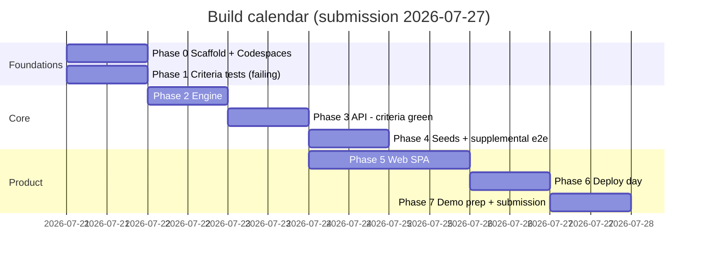

# Build Plan

This document is the law for build order and process. The assessment spec ([docs/assessment-background-job-runner.pdf](./assessment-background-job-runner.pdf)) is the outer contract; the design docs referenced below define *what* gets built; this plan defines *when*, *in what order*, and *what "done" means* at every gate. No phase starts until the previous phase's Definition of Done is met.

Evaluation priority drives sequencing: orchestration correctness > handle logic > durability > API/module boundary > tests > dashboard clarity > mobile > e2e reliability. The two hardest-checked behaviors — handle recycling without collision and restart survival — are proven by automated tests before any UI exists.

## Phase overview

| Phase | Name | Delivers | Gate |
|---|---|---|---|
| 0 | Scaffold | Workspaces, tooling, compose, devcontainer, migration runner, CI skeleton | Codespaces verified **now**, not last |
| 1 | Criteria harness | All 9 spec success-criteria tests, failing, committed | TDD Gate A |
| 2 | Engine | `@backburner/engine`: schema, allocator, state machine, dispatch, recovery | Engine unit suite green |
| 3 | API | `@backburner/api`: routes, auth, SSE, serialization | TDD Gate B: all 9 criteria green |
| 4 | Seeds + supplemental e2e | Seed module + script, full supplemental suite | Entire test matrix green |
| 5 | Web | Functional SPA per frontend brief | Manual functional checklist + suites still green |
| 6 | Deploy | Server compose, CI/CD, Cloudflare, Codespaces re-check | Full flow live at deployed URL |
| 7 | Finish | README, design pass, extensions, demo | Submission-ready |

---

## Phase 0 — Scaffold

**Inputs:** this plan; [architecture.md](./architecture.md) (stack and repository layout); the assessment PDF (Deliverables section — Codespaces is a hard requirement).

**Outputs**

- npm workspaces: `packages/engine`, `packages/api`, `packages/web`, `packages/e2e`, each with strict TypeScript config and a stub entrypoint.
- One `docker-compose.yml` using compose profiles — `dev` (postgres:18 only) and `prod` (app + postgres:18) — reused by the devcontainer and the server deploy.
- `.devcontainer/devcontainer.json` reusing the same compose file.
- `scripts/migrate.mjs`: cross-platform Node migration runner — numbered `.sql` files in root `migrations/`, applied idempotently, tracked in `schema_migrations`; runs on demand in dev/tests and on app start in the prod entrypoint.
- GitHub Actions skeleton with two jobs on every push, matching [test-plan.md](./test-plan.md) §7: a `test` job (postgres:18 service container, `npm ci`, typecheck, build, unit tests, supplemental e2e — required from Phase 0) and a `criteria` job running the 9 criteria tests (visible but non-required until Gate B promotes it).
- Root scripts: `dev`, `build`, `typecheck`, `test`, `test:unit`, `test:e2e`, `test:criteria`, `test:supplemental`, `migrate`, `seed` (stub) — where `test:e2e` = criteria + supplemental and `test` = unit + e2e — all cross-platform Node, no shell-specific syntax.

**Definition of Done**

- `npm install`, `npm run typecheck`, and an empty Vitest run succeed on Windows locally and on Linux in CI.
- `scripts/migrate.mjs` runs against a fresh database and exits 0 (bootstrap migration only).
- **Codespaces verified:** a Codespace created from the repo boots the devcontainer, reaches postgres, and runs the migration script successfully. This is checked in Phase 0 and never assumed again without re-verification.

**Non-goals:** no engine logic, no schema migrations beyond bootstrap, no routes, no UI code.

## Phase 1 — e2e harness and the 9 criteria tests

**Inputs:** [test-plan.md](./test-plan.md) (harness design, criterion-by-criterion mechanics); [api-contract.md](./api-contract.md) (contract shapes the assertions target); the assessment PDF (Success criteria section — these tests are its transcription).

**Outputs**

- `packages/e2e` harness: spawns the real API server as a child process on a random port against a dedicated test database, with env control (`WORKER_CONCURRENCY`, `BACKOFF_BASE_MS=100`); drives it via `fetch` and an EventSource client; setup/teardown may use SQL (truncate, seed test users), assertions never do.
- SSE wait utilities: await specific events with timeouts — no blind sleeps anywhere in the suite.
- Nine named black-box tests mapping 1:1 to the spec's success criteria: `criterion-01-instant-handle` through `criterion-09-restart-durability`. Key mechanics: 01 asserts POST latency under 1s against a 10s job; 06 asserts no `ready` event arrives within the job duration plus buffer after cancel; 07 reconstructs the running-count timeline from stream events with concurrency 2 and 5 jobs; 09 SIGKILLs the child mid-flight, respawns it, and asserts every task's status plus completion of re-queued work.

**Definition of Done — TDD Gate A**

- All 9 criteria tests exist, run, and **fail for the right reason** (no server implementation), not from harness defects.
- The failing suite is committed before any engine code exists — the commit history proves test-first order.
- In CI the criteria suite runs as a visible, non-blocking job until Phase 3 promotes it to required.

**Non-goals:** no application code of any kind; no supplemental suites; no attempt to make anything pass.

## Phase 2 — Engine package

**Inputs:** [architecture.md](./architecture.md) (schema, identity and handles, state machine, dispatch, recovery, engine public surface); [test-plan.md](./test-plan.md) (engine unit-test list).

**Outputs**

- Numbered migrations for `tasks` and `task_transitions`, including the partial unique index `one_active_handle` and dispatch/list/transition indexes.
- Handle allocator: per-(user, lane) advisory lock, lowest-free-number selection, bounded retry on the structural 23505 backstop.
- State machine: every transition a compare-and-swap `UPDATE ... WHERE status = <expected>`; transition row inserted in the same transaction (transactional outbox); broadcast only after commit.
- Single-flight, event-driven dispatch with `FOR UPDATE SKIP LOCKED` claim; in-process slot accounting against `WORKER_CONCURRENCY`; `Map<taskId, AbortController>`.
- Mock worker (abort-aware sleep, `params.fail`/`params.fail_permanent` handling, pinned result payload), lane registry, retry/backoff with jitter, boot recovery (re-queue or exhaust with an honest reason), graceful `stop({drain})`.
- Engine unit tests: lowest-free-number cases (gaps, empty, dense), backoff math, single-flight dispatch, serializer visibility rules.

**Definition of Done**

- Engine unit suite green on Windows and in CI.
- `@backburner/engine` has zero HTTP dependencies (verified against `package.json`).
- Criteria suite still fails — expected; there is no API yet.

**Non-goals:** no HTTP surface, no auth, no SSE transport, no seed data, no fixes made by weakening a criteria test.

## Phase 3 — API package

**Inputs:** [api-contract.md](./api-contract.md) (endpoints, error envelope, SSE mechanics, serialization, spec ambiguities and resolutions); [architecture.md](./architecture.md) (engine public surface — the only import allowed); [test-plan.md](./test-plan.md) §3.1 (the `BACKBURNER_READY` ready-line contract that binds the API entrypoint's boot output).

**Outputs**

- Fastify routes for the six spec endpoints plus documented extensions (`retry`, `/tasks/id/{id}`, `/tasks/id/{id}/history`), with JSON-schema validation.
- Bearer-key auth, `users` ownership in the API package, strict per-user scoping including the event stream; `?api_key=` accepted on `/events` only.
- SSE endpoint: transition id as event id, `?since=` and `Last-Event-ID` replay via the transitions table, heartbeat comment every `SSE_HEARTBEAT_MS`.
- Wires the engine's serializer (an engine module — see [architecture.md](./architecture.md) §2/§3 and [test-plan.md](./test-plan.md) §6) into HTTP responses; the API adds transport concerns only.
- Error envelope on all non-2xx; route/SPA coexistence rule wired (API owns exactly `/tasks*`, `/events`, `/health`).

**Definition of Done — TDD Gate B**

- **All 9 criteria tests green**, locally on Windows and in CI, with the criteria job now required.
- Engine unit suite still green; typecheck and build green across workspaces.
- No web application code exists yet.

**Non-goals:** no frontend, no seed data, no deployment work, no visual anything.

## Phase 4 — Seeds and supplemental e2e suites

**Inputs:** [test-plan.md](./test-plan.md) (supplemental suite list); [architecture.md](./architecture.md) (seed module design and distribution); [api-contract.md](./api-contract.md).

**Outputs**

- Engine-internal seed module (not part of the public runtime surface): backdated tasks with coherent synthetic transition histories, handles allocated through the real allocator so seeded active tasks cannot violate the invariant; zero fake `queued`/`running` rows.
- `npm run seed -- --tasks 300 --from 2026-04-01 --to 2026-07-21` plus `--reset` (truncates seeded data only); prints both users' raw API keys once.
- Supplemental e2e suites: auth and cross-user isolation; invalid-transition 409 matrix; allocator race (20 concurrent submits, unique handles); handle resolution after collect and after reuse; SSE replay (`?since`, `Last-Event-ID`); filters/sort/pagination; unknown-lane and params-validation 400s; collect semantics (legal on `ready` or `failed`, 409 on `queued`/`running`/`cancelled`); seed smoke test.

**Definition of Done**

- Entire test matrix green (criteria + supplemental + engine unit) on Windows and in CI.
- Seed script produces the documented status distribution; seeded rows carry `seeded=true`; `--reset` provably leaves non-seeded rows untouched.

**Non-goals:** no UI, no new endpoints, no extensions.

## Phase 5 — Web SPA

**Inputs:** [frontend-brief.md](./frontend-brief.md) (screens, iron rules, mobile priorities); [api-contract.md](./api-contract.md) (the only interface the SPA may use).

**Outputs**

- React 18 + Vite SPA with a single Zustand store: hydrated once from `GET /tasks` (using `as_of`), then mutated only by SSE events; actions call REST and let the resulting event update the store.
- Screens: Dashboard (live list, filters, sort, pagination, seeded badge), Submit (lane, duration, fail toggle, advanced max-attempts, remembered per-lane defaults), Task detail (params, transition timeline, attempts, error, result, state-appropriate actions), notifications (toast on ready/failed plus notification center).
- API-key gate on first visit (localStorage, validated via `GET /tasks`).
- Vite dev proxy for `/tasks`, `/events`, `/health`; production build served by the API package.

**Definition of Done**

- All existing suites remain green; SPA builds cleanly.
- Manual functional checklist against a seeded local instance passes: statuses update live with no refresh and no polling (verified in the network inspector); collect happens only on explicit click; action buttons disable in flight and re-enable on the resulting event; both primary phone jobs (check running tasks, submit a task) work at a 375px viewport.

**Non-goals:** final visual design (Phase 7); pixel polish; browser-automation tests; any direct engine or database access from the frontend.

## Phase 6 — Deploy

**Inputs:** [deployment.md](./deployment.md); [api-contract.md](./api-contract.md) (SSE heartbeat and reconnect semantics).

**Outputs**

- Production Docker Compose (app + postgres:18) on the target Linux server; migrations run on app start.
- GitHub Actions deploy on push to `main`.
- Cloudflare in front of the subdomain, configured so reviewer API access with a bearer key is unobstructed.
- Codespaces re-verified from a clean create.

**Definition of Done**

- Full flow works end to end at the deployed URL: submit, watch live to completion, collect, cancel mid-run, and hit the REST API directly with an API key from an outside network.
- An SSE connection through Cloudflare stays alive well past the idle window (heartbeats observed) and recovers a forced drop via `Last-Event-ID` with no missed events.
- CI green on `main`; the deployed commit equals `main` HEAD; Codespaces re-verification passes.

**Non-goals:** multi-process scaling, extensions, README rewrite (Phase 7).

## Phase 7 — README, design pass, extensions, demo

**Inputs:** all design docs; `docs/decisions/`; the assessment PDF (Deliverables section).

**Outputs**

- README covering architecture, local setup, running engine and frontend, worker pool and mock worker configuration, running the tests, seeding, Codespaces, and the API surface — an endpoint + auth summary table inline in the README (the spec explicitly requires the API be documented in the README), linking to [api-contract.md](./api-contract.md) for the full contract. Validated by following it verbatim on a clean clone.
- Deliberate visual design pass on the SPA (function is already frozen; this pass changes presentation only).
- Extensions from the backlog below — only if entered green and exited green.
- Recorded demo (15–30 minutes): part 1 shows the working system — scripted client driving the raw API while the dashboard updates live, submissions across lanes, completion notifications, cancel mid-run, failure and operator retry, restart survival on camera, direct REST calls. Part 2 is the architecture walkthrough covering the spec's seven mandatory topics, each mapped to its source material — every topic is hit on camera:
  1. Orchestration engine design — [architecture.md](./architecture.md) §§7–8, ADR 0003/0005.
  2. Handle assignment and recycling — [architecture.md](./architecture.md) §§4–6, ADR 0001/0002.
  3. Concurrency model — [architecture.md](./architecture.md) §8, ADR 0005.
  4. Durability and restart strategy — [architecture.md](./architecture.md) §11, ADR 0004/0006.
  5. Worker contract and how new workers plug in — [architecture.md](./architecture.md) §§8–10 and the lane registry (§2).
  6. Key tradeoffs — the ADR set in `docs/decisions/` and [api-contract.md](./api-contract.md) §11.
  7. What you would change with more time — [architecture.md](./architecture.md) §13.

**Definition of Done**

- All suites green on `main`; deployed URL current; README clean-clone-verified; README contains the API endpoint/auth summary; demo recorded and reviewed once for audio/pacing; repository history readable end to end.

**Non-goals:** new engine capabilities outside the backlog; refactors not demanded by the design pass.

---

## The TDD gate

Two hard gates, both enforced by commit history and CI configuration:

1. **Gate A (end of Phase 1).** All 9 criteria tests exist, run, and fail — before a single line of engine code is written. The tests are the spec's success criteria transcribed into executable form; they are never edited afterward to accommodate an implementation (fixing a genuine harness defect requires an ADR).
2. **Gate B (end of Phase 3).** All 9 criteria tests are green — before any web work starts. The criteria CI job flips from non-blocking to required at this gate and stays required forever.

If a criteria test and the implementation disagree, the test is presumed right; the spec PDF is the tiebreaker.

## Working agreements

These bind all implementation work:

1. **Docs are law.** [architecture.md](./architecture.md), [api-contract.md](./api-contract.md), [test-plan.md](./test-plan.md), [frontend-brief.md](./frontend-brief.md), [deployment.md](./deployment.md), and this plan govern implementation. Any deviation — however small — requires a new ADR in `docs/decisions/` **and** an explicit flag in the commit message or PR description. Silent drift is a defect.
2. **Blocked means stop.** When a decision is genuinely not pinned by the docs or the spec, stop and surface the question. Never guess and keep building on the guess.
3. **Byte-for-byte spec shapes.** The six spec endpoint paths, the nine task-object fields, the four spec event shapes, and the status enum are reproduced exactly — never renamed, reshaped, or "improved." Everything beyond them is additive and documented as an extension.
4. **Package boundaries.**
   - `@backburner/engine` has no HTTP dependencies and owns `tasks` and `task_transitions`.
   - `@backburner/api` reaches engine-owned tables only through the engine's public surface — never with its own SQL. It owns `users` and may query only that.
   - `@backburner/web` is a pure API consumer: HTTP and SSE only; it never imports engine or API code and never touches the database.
   - `@backburner/e2e` is black-box: SQL is allowed in setup/teardown only, never in assertions.
5. **Cross-platform scripts.** Everything runs on Windows, Linux, and Codespaces. npm scripts contain no bash-isms; anything non-trivial is a Node script using `node:path`; line endings are normalized via `.gitattributes`. CI on Linux from Phase 0 keeps the second platform honest continuously.

## Commit conventions

- Conventional Commits: `feat` / `fix` / `test` / `docs` / `chore` / `refactor` / `ci`, with scopes `engine`, `api`, `web`, `e2e`, `migrations`, `deploy`, `docs` (e.g. `feat(engine): allocate lowest free handle under advisory lock`).
- History tells the story: the Phase 1 commit that lands 9 failing criteria tests precedes the first engine commit; the Gate B commit is identifiable; each phase closes with a commit noting its gate.
- Small, single-purpose commits; no work-in-progress noise on `main`; CI must pass on every push once its jobs are marked required for the current phase.
- Migration files are append-only once committed; a schema change is a new numbered migration, never an edit.

## Risk register

| Risk | Impact | Mitigation | Early warning |
|---|---|---|---|
| Codespaces breakage | Hard deliverable fails at review time | Devcontainer reuses the same compose file as local dev; verified in Phase 0 from a clean create and re-verified in Phase 6; setup steps live in scripts, not in a README ritual | Any devcontainer or compose change without a Codespaces re-check |
| Cloudflare drops idle SSE (~100s) | Live dashboard silently dies in the deployed demo | Heartbeat comment every 20s (`SSE_HEARTBEAT_MS`); `Last-Event-ID` reconnect replays missed events, so a drop is degraded, not fatal; verified through the actual proxy in Phase 6, including a forced-drop recovery test | SSE connection age never exceeding ~100s in server logs |
| Windows/Linux differences | Scripts or tests pass locally, fail in CI or on the server | Cross-platform Node scripts only; no shell-specific npm scripts; `.gitattributes` line-ending normalization; Linux CI from Phase 0 so divergence surfaces within one push | First CI-only failure — treat as a stop-the-line defect, not a re-run |
| Timing-flaky tests | Criteria suite (the submission's spine) loses credibility | Waits are event-driven with timeouts — never blind sleeps; `BACKOFF_BASE_MS=100` and concurrency overrides in tests; generous CI bounds; a flake is a bug to fix, never a test to auto-retry | Any test that passes on re-run after failing |

## Calendar

Target submission: **2026-07-27**.

| Date | Day | Plan |
|---|---|---|
| 2026-07-21 | Tue | Phase 0 (Codespaces verified) and Phase 1 (Gate A: 9 failing tests committed) |
| 2026-07-22 | Wed | Phase 2 — engine core; unit suite green by end of day |
| 2026-07-23 | Thu | Phase 3 — API; **Gate B: all 9 criteria green** |
| 2026-07-24 | Fri | Phase 4 — seeds and supplemental suites; start Phase 5 |
| 2026-07-25 | Sat | Phase 5 — SPA functionally complete against the frontend brief |
| 2026-07-26 | Sun | **Deploy day** — Phase 6 end to end, Cloudflare SSE verified, Codespaces re-check |
| 2026-07-27 | Mon | **Demo-prep day** — Phase 7: README, design pass, extensions if green, record demo, submit |

Slack policy: Gate B is the schedule's keystone. If it slips past Thursday, Phase 5 scope shrinks before Phase 6 or 7 moves — the deploy and demo days are fixed. Extensions are the first thing cut, the design pass the second; the criteria suite and deployment are never cut.

## Extensions backlog (post-green only)

No extension work begins unless the full test matrix is green and Phases 0–6 are complete; every extension lands with its own tests and documentation and must leave the matrix green.

| Extension | Scope | Acceptance |
|---|---|---|
| Webhook subscriptions | One primitive: a subscription is a URL plus a set of lifecycle stages; matching transitions POST an event envelope. ntfy.sh and Slack are just targets, not integrations | Registering a subscription delivers a POST per matching event containing the event JSON plus delivery metadata; delivery failures are logged and retried without ever affecting engine state; covered by a test using a local receiver |
| Job timeout (`max_runtime_ms`) | Per-submit cap; on expiry the engine aborts via the existing AbortController and records a retryable failure with an honest reason | A job with `max_runtime_ms` below its duration aborts on time, lands as a retryable failure naming the timeout, and retries under normal backoff; validated bounds on the param; no effect on jobs without it |
| Delayed jobs (`run_at`) | Per-submit start time mapped onto the existing `run_after` column and dispatch timer | A job with a future `run_at` is accepted immediately, is never claimed early, and starts within the dispatch timer's tolerance of `run_at`; visible as queued-with-schedule in the dashboard |
| Scripted API client demo | A standalone script exercising submit/watch/collect against the deployed API, used to open the demo recording | The script runs against the deployed URL with only an API key, and the dashboard visibly reacts live; no engine or API changes required |
| Task counts | ✅ **Built** (ADR 0018) — and since extended with `uncollected` as a *filter* as well as a count, plus `lane_defaults` ([ADR 0021](./decisions/0021-flaky-outcomes-attempt-context-and-per-lane-durations.md), [ADR 0022](./decisions/0022-uncollected-and-search-list-filters.md)). **The Phase 5 dashboard design depended on this — see note below.** Aggregate counts per status and per lane for the authenticated user, surfaced either as an additive `counts` object on the `GET /tasks` response or as a dedicated `GET /tasks/counts` route (whichever proves cleaner). Engine exposes a `counts()` method — the API never runs its own SQL against `tasks` | Counts respect every active filter *except* `status` (and except `lane` for the per-lane counts), so selecting a status shows exactly the number advertised; a stale or filter-incoherent count is a defect, not a rounding error. Covered by a supplemental suite asserting count/row agreement under each filter combination |
| Task text search | ✅ **Built** during the Phase 5 QA pass, scoped to handle and id (not `error.reason`) as the `q` param on `GET /tasks`. Matching is case-insensitive equality-or-prefix, server-ranked, and scoped to the key's user like every other read; the entry's original "**Not required for Phase 5**" note is superseded, because the dashboard's search affordance is no longer an exact lookup. See [ADR 0022](./decisions/0022-uncollected-and-search-list-filters.md) and [ADR 0027](./decisions/0027-search-overlay-reads-the-server.md) | Covered by `list-search.test.ts`: the matching set, the ranking, the null `next_cursor`, and the two `400`s (`q`+`sort`, `q`+`cursor`) |

**Note on task counts and the post-green rule.** Task counts are the one backlog entry the Phase 5 design pass has already committed to: the dashboard's primary navigation is a status list carrying per-status and per-lane totals, which no current endpoint can serve. That makes counts a Phase 5 *dependency* rather than a post-green extension, and it is the one entry in this table exempt from the "no extension work until Phases 0–6 are complete" rule above. The exemption is deliberate and bounded — it covers counts only. Until the endpoint exists, the dashboard must not display a total it cannot source; a count derived client-side from a paginated page is invented state and is barred by the same honesty rule that governs every other number in the UI ([frontend-brief.md](./frontend-brief.md) §6.5).
