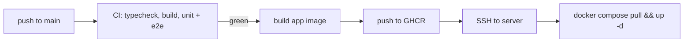

# Deployment

This document pins how BackBurner reaches its deployed URL — a hard deliverable of the assessment spec ([docs/assessment-background-job-runner.pdf](./assessment-background-job-runner.pdf)): the full flow must work end to end in production, and a reviewer must be able to hit the REST API directly with an API key. [build-plan.md](./build-plan.md) Phase 6 executes this document; its Definition of Done is the acceptance test for everything below.

## 1. Topology

- **One Linux server.** Single-host Docker Compose — no orchestrator, no fleet. The spec asks for "any host that supports a long-running backend process"; one server keeps the moving parts countable.
- **One compose file.** The repo's single `docker-compose.yml` carries dev and prod profiles. Production runs the `prod` profile: the `app` container plus `postgres:18`.
- **Postgres data on a named volume.** Durability across restarts is the engine's centerpiece; the database must survive container recreation, not just process restarts.
- **`restart: unless-stopped`** on both services, so a server reboot brings the stack back without intervention.
- **Public entry:** `backburner.danielbierman.ca`, a Cloudflare-proxied subdomain (§4). Public TLS terminates at Cloudflare; Postgres is never exposed publicly — only the app answers external traffic.

## 2. Application image

A multi-stage `Dockerfile` on Node 22 (the same runtime as local dev and CI):

1. **Build stage** — install workspace dependencies, then build `engine`, `api`, and `web`.
2. **Runtime stage** — production dependencies, built output, `migrations/`, and `scripts/migrate.mjs` only.

The production entrypoint verifies, then runs, migrations before serving traffic: `scripts/migrate.mjs` checks the `schema_migrations` ledger, applies any pending numbered migrations (idempotently — a no-op restart is safe), and only then starts the api, which serves both the REST/SSE surface and the built SPA per the route-coexistence rule in [api-contract.md](./api-contract.md). A container that cannot migrate does not start — the app never runs against a schema it does not expect.

## 3. Deploy pipeline

- **Trigger:** GitHub Actions on push to `main`, gated on CI green — the deploy job depends on the test jobs and never runs on a red build.
- **Build and publish:** the workflow builds the app image and pushes it to GHCR, tagged with the commit SHA (plus a moving tag the server's compose file references).
- **Roll out:** the workflow connects over SSH — host and key held in repository secrets — and runs `docker compose pull && docker compose --profile prod up -d`. The entrypoint applies migrations on start (§2), so schema changes ship in the same motion as code.
- **Invariant:** the deployed commit equals `main` HEAD. The workflow is the only deploy path and deploys exactly the SHA it built — no manual deploys, no drift.

## 4. Cloudflare and SSE

The subdomain sits behind a proxied (orange-cloud) Cloudflare DNS record. That buys TLS and caching but creates the one production hazard this design must answer for: **Cloudflare drops streams idle for roughly 100 seconds**, and `/events` is a long-lived SSE stream that can be quiet for minutes.

- The api emits a `: hb` heartbeat comment every 20 s (`SSE_HEARTBEAT_MS`) — five heartbeats inside the idle window, so the stream is never quiet long enough to be culled. `EventSource` ignores comments; the mechanics live in [api-contract.md](./api-contract.md).
- If a drop happens anyway, it is degraded rather than fatal: `EventSource` reconnects with `Last-Event-ID`, and the transition journal replays everything missed.

**Phase 6 verification (pinned):** an SSE connection through the actual proxy is observed alive well past the idle window with heartbeats arriving, and a forced drop is recovered via `Last-Event-ID` with no missed events. Verified against production, not a local stand-in — the proxy is the thing under test.

## 5. Reviewer access

- **Cloudflare Access is not enabled on this subdomain** (the default decision). The app's own bearer-key auth is the only gate, so reviewer API access — `curl` with an `Authorization: Bearer` key from any network — is unobstructed, exactly as the spec's deliverable requires.
- **Fallback:** if Access is ever enabled account-wide, a service token scoped to this subdomain is documented for reviewers instead. Either way, direct API access is re-verified from an outside network before submission — an allow rule that only works from the author's own network is a silent failure of the deliverable.

## 6. Secrets and environment

- The runtime environment variables (the configuration table in [architecture.md](./architecture.md) §13) are supplied by a server-side `.env` file consumed by compose. **Nothing secret lives in the repo** — no connection strings, no API keys, no credentials in compose files or workflows.
- GitHub repository secrets hold only what the deploy job needs: the SSH host and key, and registry credentials for GHCR.

## 7. Codespaces re-verification

Codespaces is a hard spec deliverable and shares the compose file this document deploys. Per [build-plan.md](./build-plan.md), Phase 6 re-verifies a **clean Codespace create** — devcontainer boots, Postgres reachable, migrations run — so that deploy-era changes to the compose file or Dockerfile cannot silently break the other environment that depends on them.
