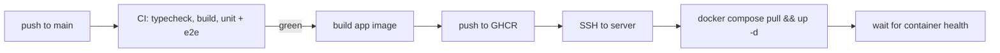

# Deployment

This document pins how BackBurner reaches its deployed URL — a hard deliverable of the assessment spec ([docs/assessment-background-job-runner.pdf](./assessment-background-job-runner.pdf)): the full flow must work end to end in production, and a reviewer must be able to hit the REST API directly with an API key. [build-plan.md](./build-plan.md) Phase 6 executes this document; its Definition of Done is the acceptance test for everything below.

## 1. Topology

- **One Linux server.** Single-host Docker Compose — no orchestrator, no fleet. The spec asks for "any host that supports a long-running backend process"; one server keeps the moving parts countable.
- **One compose file.** The repo's single `docker-compose.yml` carries dev and prod profiles. Production runs the `prod` profile: the `app` container plus `postgres:18`.
- **Postgres data on a named volume.** Durability across restarts is the engine's centerpiece; the database must survive container recreation, not just process restarts.
- **`restart: unless-stopped`** on both services, so a server reboot brings the stack back without intervention.
- **Public entry:** `backburner.danielbierman.ca`, reached through the server's existing Cloudflare Tunnel (§4). Public TLS terminates at Cloudflare. The stack publishes **no** public port: the app joins the tunnel's Docker network under the alias `backburner`, and both services bind only `127.0.0.1` on the host, for operator diagnosis. Postgres is never exposed publicly — only the app answers external traffic, and only via the tunnel ([ADR 0029](./decisions/0029-cloudflare-tunnel-as-the-production-edge.md)).

## 2. Application image

A multi-stage `Dockerfile` on Node 22 (the same runtime as local dev and CI):

1. **Build stage** — install workspace dependencies, then build `engine`, `api`, and `web`.
2. **Runtime stage** — production dependencies, built output, `migrations/`, and three scripts: `migrate.mjs`, `start.mjs` (the entrypoint), and `seed.mjs`.

`seed.mjs` ships in the image because raw API keys are printed exactly once and are unrecoverable afterward (api-contract §2) — provisioning the reviewer's key on the deployed instance has to happen there, via `docker compose exec app node scripts/seed.mjs`. It composes the already-present `packages/engine/dist/seed.js` and `packages/api/dist/users.js` and needs nothing else.

The runtime layout is not free-form: `packages/api/dist/server.js` resolves the repo root three levels up from its own directory and reads `migrations/` and `packages/web/dist` from there. The image reproduces that layout exactly.

The production entrypoint verifies, then runs, migrations before serving traffic: `scripts/migrate.mjs` checks the `schema_migrations` ledger, applies any pending numbered migrations (idempotently — a no-op restart is safe), and only then starts the api, which serves both the REST/SSE surface and the built SPA per the route-coexistence rule in [api-contract.md](./api-contract.md). A container that cannot migrate does not start — the app never runs against a schema it does not expect.

## 3. Deploy pipeline

- **Trigger:** GitHub Actions on push to `main`, gated on CI green — the `deploy` job `needs: [test, criteria]` and never runs on a red build. It lives in `ci.yml` alongside them so the gate is a job dependency rather than a cross-workflow guess.
- **Build and publish:** the workflow builds the app image and pushes it to GHCR under two tags — the immutable `:<sha>` the server is told to run, and the moving `:main` tag `docker-compose.yml` falls back to for manual operations on the box.
- **Roll out:** the workflow connects over SSH — host, user, key, and pinned host key held in repository secrets — copies `main`'s `docker-compose.yml` to the deploy directory, then runs `docker compose pull && docker compose --profile prod up -d` with `APP_IMAGE` pinned to the SHA it just built. The entrypoint applies migrations on start (§2), so schema changes ship in the same motion as code.
- **Verify:** the workflow then waits on the app container's healthcheck and fails the deploy — dumping container logs — if it never reaches `healthy`. A rollout that leaves the app down goes red in Actions rather than being discovered on camera.
- **Serialization:** the `deploy` job takes its own concurrency group with `cancel-in-progress: false`. The workflow-level group cancels superseded CI runs, which is right for tests and wrong for a deploy — cancelling between `pull` and `up -d` would leave the server holding an image it never started.
- **Host key pinning:** the SSH step writes a known-hosts entry from a secret rather than using `StrictHostKeyChecking=no`. This step hands shell access to the server; accepting any host key would hand it to anything that can answer on that address.
- **Invariant:** the deployed commit equals `main` HEAD. The workflow is the only deploy path, deploys exactly the SHA it built, and replaces the server's compose file from `main` on every run — so the invariant covers the topology, not just the image.

## 4. Cloudflare and SSE

The subdomain is served through the server's existing Cloudflare Tunnel — a proxied CNAME to the tunnel rather than a proxied A record to an exposed origin port, for the reasons in [ADR 0029](./decisions/0029-cloudflare-tunnel-as-the-production-edge.md) (Cloudflare's proxy will not connect to an origin on port 3000, and the plaintext-origin alternative would put reviewers' bearer keys on the wire in the clear).

That buys TLS and caching but creates the one production hazard this design must answer for: **Cloudflare drops streams idle for roughly 100 seconds**, and `/events` is a long-lived SSE stream that can be quiet for minutes. A tunnel is still Cloudflare's edge, so the hazard and its answer are unchanged.

- The api emits a `: hb` heartbeat comment every 20 s (`SSE_HEARTBEAT_MS`) — five heartbeats inside the idle window, so the stream is never quiet long enough to be culled. `EventSource` ignores comments; the mechanics live in [api-contract.md](./api-contract.md).
- If a drop happens anyway, it is degraded rather than fatal: `EventSource` reconnects with `Last-Event-ID`, and the transition journal replays everything missed.

**Phase 6 verification (pinned):** an SSE connection through the actual tunnel is observed alive well past the idle window with heartbeats arriving, and a forced drop is recovered via `Last-Event-ID` with no missed events. Verified against production, not a local stand-in — the edge is the thing under test.

The heartbeat was verified against the containerized stack before deploy — `: hb` observed on an idle stream at the 20 s mark — so a failure at this gate isolates cleanly to the tunnel rather than to the app.

## 5. Reviewer access

- **Cloudflare Access is not enabled on this subdomain** (the default decision). The app's own bearer-key auth is the only gate, so reviewer API access — `curl` with an `Authorization: Bearer` key from any network — is unobstructed, exactly as the spec's deliverable requires.
- **Fallback:** if Access is ever enabled account-wide, a service token scoped to this subdomain is documented for reviewers instead. Either way, direct API access is re-verified from an outside network before submission — an allow rule that only works from the author's own network is a silent failure of the deliverable.

## 6. Secrets and environment

- The runtime environment variables (the configuration table in [architecture.md](./architecture.md) §13) are supplied by a server-side `.env` file in the deploy directory, which compose loads automatically — using it both to interpolate `docker-compose.yml` and to configure the app container. **Nothing secret lives in the repo** — no connection strings, no API keys, no credentials in compose files or workflows. `.env.example` is the annotated template.

  | Server `.env` key | Purpose |
  |---|---|
  | `POSTGRES_PASSWORD` | Database password; also composed into the app's `DATABASE_URL` |
  | `POSTGRES_DB` | Application database name (created on first volume init only) |
  | `EDGE_NETWORK` | Name of the pre-existing Docker network the tunnel sits on (§4) |
  | `WORKER_CONCURRENCY`, `BACKOFF_BASE_MS`, `SSE_HEARTBEAT_MS`, `DRAIN_TIMEOUT_MS` | Engine tuning; every knob is set explicitly in compose rather than left to defaults, because a silently defaulted `SSE_HEARTBEAT_MS` is exactly the failure that only appears in production |

  `DATABASE_URL` is deliberately **not** a server `.env` key: compose composes it from `POSTGRES_PASSWORD` and `POSTGRES_DB` against the `postgres` service name. Setting it by hand would point the container at a host that does not exist inside it.

- GitHub repository secrets hold only what the deploy job needs. GHCR needs no credential of its own — the workflow authenticates with the automatic `GITHUB_TOKEN` under `packages: write`.

  | Secret | Purpose |
  |---|---|
  | `DEPLOY_HOST` | Server hostname or IP for SSH |
  | `DEPLOY_USER` | SSH user (a member of the `docker` group) |
  | `DEPLOY_SSH_KEY` | Private key of a deploy-only keypair |
  | `DEPLOY_KNOWN_HOSTS` | The server's public host key, pinned — see §3 |
  | `DEPLOY_DIR` | Deploy directory holding `docker-compose.yml` and `.env` (defaults to `/opt/backburner`) |

## 7. Codespaces re-verification

Codespaces is a hard spec deliverable and shares the compose file this document deploys. Per [build-plan.md](./build-plan.md), Phase 6 re-verifies a **clean Codespace create** — devcontainer boots, Postgres reachable, migrations run — so that deploy-era changes to the compose file or Dockerfile cannot silently break the other environment that depends on them.
