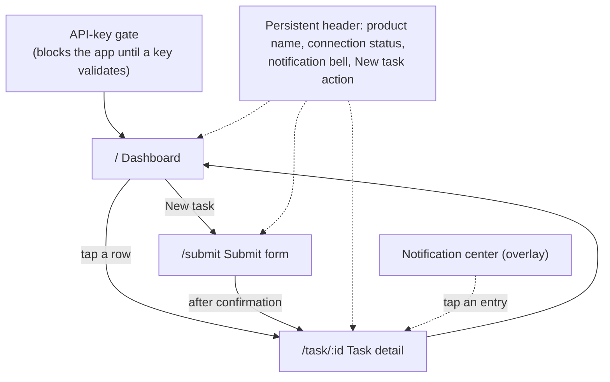
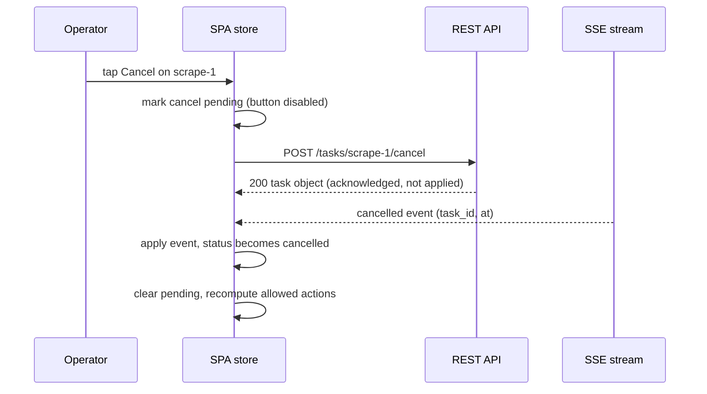

# BackBurner — Frontend Brief

Functional and information-architecture specification for the BackBurner dashboard SPA (`packages/web`). This document is self-contained: it defines every screen, state, interaction rule, and data shape the frontend consumes. Final visual styling is deliberately deferred to a dedicated design pass (see [Out of scope](#12-out-of-scope--tone)); this brief pins *what* the interface does, not what it looks like.

The SPA is a pure consumer of the BackBurner REST API. It never imports engine code and never touches the database. Everything described here is achievable through the documented API surface in the [data digest](#8-data-digest).

---

## 1. Product narrative

BackBurner runs slow background work — scrapes, report generation, anything that takes seconds to minutes — so people never have to block on it. An operator submits a task, gets a short human handle (`scrape-1`) back instantly, and moves on. The engine runs the work under a concurrency limit, tracks it through a strict lifecycle (`queued → running → ready | failed | cancelled`), and announces the moment it finishes.

The dashboard is the operations window onto that engine. Its job is **honest, live observability**: every task the user owns, its real status right now, and the actions that status permits — nothing speculative, nothing stale, nothing that pretends work happened before the engine confirmed it. When a task finishes, the user hears about it without asking. When something fails, the reason is shown in full and the recovery action (retry) is one tap away.

Handles are the product's signature detail. They are short leased aliases, recycled after a task is collected or cancelled — so `scrape-1` today may be a different task than `scrape-1` yesterday. The UI treats the immutable task `id` as the true identity (detail links, event correlation) and displays the handle as the human name.

### 1.1 The two mobile-first jobs

Every layout decision optimizes for two things a person actually does from a phone:

1. **Check on running tasks.** "Is my scrape done yet? Did anything fail overnight?" — open the dashboard, see live statuses at a glance, get a completion or failure notification without touching anything, tap through for detail, collect a result or retry a failure with one tap.
2. **Submit a task.** Pick a lane, accept the remembered duration default (or tweak it), tap submit, see the handle confirmed within a second.

Both flows must be complete, fast, and comfortable one-handed on a small screen. Every other capability (filtering history, browsing seed data, reading transition timelines) must *work* well on mobile but is optimized for desktop.

---

## 2. Information architecture

Client-side routes (deliberately disjoint from API paths, which own `/tasks*`, `/events`, `/health`):

| Route | Screen |
|---|---|
| `/` | Dashboard — task list |
| `/submit` | Submit a task |
| `/task/:id` | Task detail (keyed by immutable task `id`, **not** handle — handles recycle, links must not) |

Two surfaces exist outside routing:

- **API-key gate** — replaces the app shell whenever no validated key is present.
- **Notification layer** — toasts plus a notification-center panel, reachable from the persistent header on every screen.



**Persistent header** (all authenticated screens): product name *BackBurner* (links to `/`), live-connection indicator (see §5.4), notification bell with unread count (§7), primary "New task" action, and an overflow menu containing "Change API key" (clears the stored key, returns to the gate).

---

## 3. Status → allowed actions matrix

One canonical matrix drives every action button in the app — dashboard rows and the detail screen render from the same rules. The UI never offers an action the engine would reject; if a race makes one stale, the API answers `409 invalid_state` and the UI reports the actual current status.

| Status | Collect | Cancel | Retry | Notes |
|---|---|---|---|---|
| `queued` | — | ✅ | — | Cancel releases the handle immediately. |
| `running` | — | ✅ | — | Cancel actually aborts the worker; confirmed by the `cancelled` event. |
| `ready`, `collected: false` | ✅ | — | — | Collect is the **only** release path for ready work. |
| `ready`, `collected: true` | — | — | — | Terminal. View-only; result displayed. |
| `failed`, `collected: false` | ✅ (labeled **"Collect / acknowledge"**) | — | ✅ | Retry re-queues with a fresh attempt budget, only while uncollected. Collect acknowledges the failure and releases its handle — the same release path `ready` work uses — and permanently retires Retry on this task. |
| `failed`, `collected: true` | — | — | — | Terminal. View-only; error remains displayed. |
| `cancelled` | — | — | — | Terminal. View-only. |

Cancel never appears on a `failed` row: cancel is legal only from `queued` or `running`, and a failed task has already stopped — there is nothing left to stop. The operator's two verbs on a failed task are retry (while uncollected) and collect/acknowledge; collect is the release path, exactly like `ready` work.

Actions in flight follow the pending rule in §6.4: pressed button disables, and re-enables only when the confirming event arrives.

---

## 4. Screen inventory

Each screen is specified as: purpose, elements, and states. All list/detail data flows through the store described in §5 — screens render store state; they do not fetch on a timer.

### 4.1 API-key gate

**Purpose.** BackBurner has no signup flow. Access is a per-user API key (format `bb_` + 40 hex characters), issued out of band (the seed script prints keys for the seeded users). The gate collects and validates a key before any app surface renders.

**When shown.** First visit; after "Change API key"; and whenever any API call returns `401 unauthorized` (the stored key is discarded and the user lands back here with an explanatory message).

**Elements.**
- Product name and one-sentence description ("BackBurner — background job runner. Enter your API key to open your dashboard.").
- Key input: single field, masked by default with a show/hide toggle, `autocomplete="off"`, paste-friendly, trims whitespace.
- **Connect** button.
- Inline error line below the field.
- Fine print: "Your key is stored only in this browser."

**Behavior.** On Connect, the key is validated with a real `GET /tasks?limit=1` call. Success stores the key in `localStorage` and enters the app (snapshot + SSE per §5). The key is sent as `Authorization: Bearer <key>` on REST calls and as `?api_key=` on the SSE URL (the browser `EventSource` API cannot set headers).

**States.**

| State | Presentation |
|---|---|
| Idle | Field + disabled Connect until non-empty input. |
| Validating (loading) | Connect disabled with progress affordance; field locked. |
| Error — rejected key | "That key was not accepted." (from `401`); field retains input, focused for correction. |
| Error — network | "Could not reach the server." with a retry hint; input preserved. |
| Kicked back mid-session | Same screen plus banner: "Your API key stopped working; enter a valid key to continue." |

There is no empty/live distinction here; the gate is a single-purpose form.

### 4.2 Dashboard (`/`)

**Purpose.** The operations view: every task the key's user owns, live, filterable, sortable, actionable. This is the default screen and the primary mobile surface.

**Elements.**
- Persistent header (§2).
- **Filter bar** (maps 1:1 to `GET /tasks` query params):
  - Status filter — the five statuses (`queued`, `running`, `ready`, `failed`, `cancelled`) plus "All". Single-select.
  - **"To collect" filter** — `?uncollected=true`, which restricts the list to `status IN ('ready','failed') AND collected = false`. This is the *exact* predicate behind `counts.uncollected`, so the number and the list it opens can never disagree. It is a toggle, sent as the literal `true` or omitted entirely — the API rejects `false` (api-contract §7). It is **not** a status and never appears inside the status control: it spans two statuses plus the lease flag, and "there is no sixth status" (`ui-spec.md` §3.1) has to keep reading true. Placement per `ui-spec.md` §3.10: its own sidebar row, the leading chip on the mobile rail and in the filter sheet, and a pressable number in the register toolbar.
  - Lane filter — "All" plus one entry per lane in `counts.lanes` (the engine's *registered* lanes, so a user with zero tasks still gets a working picker).
  - Date range — from/to date pickers filtering on `created_at`.
  - Sort — `created_at` or `updated_at`, ascending/descending; default `created_at` descending (newest first).
  - "Clear filters" affordance, visible only when any filter is active. It clears the uncollected filter too.
- **Toolbar counts are controls.** `N to collect · N running` are two buttons that apply the filter they name and toggle off on a second press. A count that opens the list it describes is the rule (`ui-spec.md` §3.10); a count that opens nothing is a dead end.
- **Task list.** Cards on mobile, table on desktop (§9). Each item shows:
  - Handle (`scrape-1`) — the human name, prominent.
  - Status chip — the status string verbatim, never paraphrased. A `ready` task with `collected: true` shows a supplementary "collected" marker; the UI never invents a sixth status.
  - Lane.
  - **Seeded badge** on tasks with `seeded: true` (§6.2).
  - Created timestamp (relative, e.g. "4 m ago", with absolute ISO time on hover/long-press) and, for `running` tasks, a live elapsed timer derived from `updated_at` (presentational client-side ticker — not data polling).
  - Attempts as `attempts / max_attempts` when `attempts > 0`.
  - For `failed` rows: the first line of `error.reason`.
  - Inline primary action per the §3 matrix (Collect / Cancel / Retry). Where two actions apply (`failed`, uncollected), Retry is inline and Collect/acknowledge lives on the detail screen and in an overflow affordance.
  - The whole item links to `/task/:id`.
- ~~**Load more** button when `next_cursor` is non-null~~ — **superseded.** Cursor pagination and the default page size of 50 stand, but the affordance is an infinite-scroll sentinel, not a button; there is no "Load more" control anywhere in the application. The sentinel is focusable and announces the remaining count, so it is not mouse-only. See [ADR 0019](./decisions/0019-infinite-scroll-over-load-more.md) and [`ui-spec.md`](./ui-spec.md) §7.
- New-task entry point: header action on desktop; a reachable-with-the-thumb primary button on mobile.

**Live behavior.** Rows update in place as SSE events land: status chips change, `queued` rows flip to `running`, finished rows re-sort per the active sort on next render. Newly accepted tasks appear at the correct sort position (top, under the default sort) if they match the active filters. Tasks transitioning *out* of a status filter leave the visible list immediately — the list is always a true answer to the filter question. No refresh control exists anywhere; there is nothing to refresh.

**States.**

| State | Presentation |
|---|---|
| Loading | Skeleton rows in the list area; filter bar interactive but inert. Shown during initial snapshot and on any filter change (each filter change issues a fresh snapshot request). |
| Empty — no tasks at all | "No tasks yet." plus a prominent "Submit your first task" button. |
| Empty — filters exclude everything | "No tasks match these filters." plus "Clear filters". Distinct copy from true-empty. |
| Error | Snapshot failed: inline error panel with the message from the error envelope and a **Retry** button (retries the snapshot). Never a blank screen. |
| Live | List rendered and mutating via SSE; connection indicator shows "Live". |
| Degraded live | SSE reconnecting: list stays rendered (last known state), connection indicator shows "Reconnecting…" (§5.4). |

### 4.3 Submit (`/submit`)

**Purpose.** Enqueue a task in seconds — the second mobile job. Optimized for the repeat case: same lane, same duration, one tap.

**Elements.**
- Lane select — one option per lane in `counts.lanes`, in registration order. Required. Remembers the last-used lane within the session.
- **Duration** (`duration_ms`) — numeric field, milliseconds, with a live humanized preview ("10 000 ms ≈ 10 s"). Optional: left blank, the engine picks a random duration **from the selected lane's own range**. That range is stated in the helper text and is sourced from `counts.lane_defaults` — it is 3–15 s on most lanes and 20–90 s on `build`, so a hard-coded figure would be wrong somewhere. When the server omits `lane_defaults`, the sentence states no range at all rather than guessing one (§6.5). Validation: positive integer ≤ 600 000.
- Per-lane remembered default (§6.3): the field prefills from the stored default for the selected lane; when the entered value differs from the stored default, a **"Set as default for scrape"** affordance appears next to the field.
- **Advanced** (collapsed by default) holds the two controls a routine submit does not touch. The collapsed toggle names the current outcome (`outcome · random`), so a non-default choice is never hidden.
  - Max attempts (`max_attempts`) — integer 1–10; helper text: "Automatic retries with backoff before the task lands in failed."
  - **Outcome** select — five options: **Random** (default), **Succeed**, **Fail — retryable** (`fail: true`), **Fail — permanent** (`fail_permanent: true`), **Flaky** (`fail_times: n`). Each states what the mock worker will do, in the worker's terms; this control is how demos and tests exercise every outcome the spec has.
    - **Random is resolved client-side, at press**, into explicit params — succeed 0.65, flaky 0.15, `fail` 0.13, `fail_permanent` 0.07. It is deliberately not a server default: the nine criteria tests submit with `duration_ms` only and require deterministic success, so the engine's no-outcome-param path must stay a guaranteed success (`api-contract.md` §1). The RNG sits behind an injectable seam so the roll is unit-tested. See ADR 0028.
    - **Flaky** fails retryably for the first `fail_times` attempts and then succeeds. It must be able to recover, so `fail_times` stays strictly below the attempt budget: with `max_attempts` blank the SPA cannot see the lane's configured default and clamps to **1**; with `max_attempts` set to N it allows 1…N−1; at N = 1 the option is **disabled** with an inline note that a flaky task needs a budget above 1. The random roll obeys the same bound. Choosing Flaky explicitly reveals a compact `fail_times` field (integer, default 1) so a demo is reproducible.
- **Submit** button.
- Post-confirmation panel (replaces the button area after success): "Accepted as **scrape-2**" with two actions — **View task** (→ `/task/:id`) and **Submit another** (resets the panel, keeps lane and duration).

**Behavior.** Submit issues `POST /tasks` with `{lane, params: {duration_ms?, fail?, fail_permanent?, fail_times?}, max_attempts?}`. The response (`201`, full task object with `id` and `handle`) identifies the task, but the confirmation panel appears only when the `accepted` event lands in the store (§6.4). The handle comes back well under a second, so this feels instant; the discipline matters because the store is the single source of truth.

**States.**

| State | Presentation |
|---|---|
| Idle | Form with prefilled lane/duration defaults and Outcome at Random. |
| Invalid | Inline per-field errors on blur and on submit attempt (duration range, max-attempts range, fail-times bound). Submit disabled while invalid; a failed submit opens ADVANCED if that is where the first invalid field lives. |
| Submitting (loading) | Submit disabled with progress affordance until the confirming `accepted` event arrives. |
| Error | `400 unknown_lane` / `400 invalid_params`: envelope message shown inline at the top of the form, fields re-enabled. `401`: → API-key gate. Network failure: inline retryable error. |
| Success (live) | Confirmation panel with handle and follow-up actions. |

Empty state is not applicable — the form is its own content.

### 4.4 Task detail (`/task/:id`)

**Purpose.** Everything about one task: parameters, full state history, attempts, complete error, result, and every action its status permits. Routed by immutable `id` so links survive handle recycling.

**Data.** On mount: `GET /tasks/id/{id}` (task) and `GET /tasks/id/{id}/history` (transition timeline). After that, live updates arrive via SSE matched on `task_id`; each incoming event for this task also appends to the displayed timeline. These mount-time fetches are navigation-driven reads, not polling.

**Elements.**
- Identity block: handle (large), lane, status chip, seeded badge if `seeded`, immutable id (small, copyable — this is what scripts and links use).
- Metadata: created / updated timestamps (absolute ISO, with relative supplement), attempts `x / max_attempts`.
- **Params** panel: pretty-printed JSON of `params`.
- **Timeline** panel: the transition history, newest last — one entry per transition: event type, `from_status → to_status`, timestamp, and meaningful metadata rendered plainly (attempt number for retries, "automatic retry after restart" when `meta.recovery` is true, "operator retry" when operator-initiated, scheduled `run_after` when backoff applies).
- **Error** panel (only when status is `failed`): full `error.reason` verbatim — never truncated — plus a clear retryable/non-retryable indicator explaining what happens next ("The engine will not retry this on its own; Retry restarts it with a fresh attempt budget."). This panel renders identically whether the task is collected or not — the full error is visible the moment the task lands in `failed`; collecting does not gate error visibility. It never disappears: after collection the error stays displayed, only the action bar changes.
- **Result** panel:
  - Hidden for `queued`/`running`/`cancelled`.
  - `ready`, uncollected: a "Result ready" panel whose single action is **Collect result** — the payload itself is revealed by collecting (§6.1).
  - Collected (including seeded history): pretty-printed JSON of `result` (mock worker payload: `{ message, slept_ms }`).
  - `failed` never populates this panel (`result` is always `null` on a failed task) — the Error panel above is where a failed task's outcome lives, both before and after collection.
- **Action bar**: Collect / Cancel / Retry per the §3 matrix, each following the pending discipline of §6.4. On a `failed`, uncollected task the bar shows **Retry** and **Collect / acknowledge** — collecting is a pure acknowledge-and-archive action: it frees the handle and permanently retires Retry, but never changes what the Error panel shows, since the full error was already visible. Destructive confirmation: Cancel asks for one confirmation ("Cancel scrape-1? A running worker will be stopped."); Collect on a failed task asks for one confirmation too ("Collect scrape-1? This archives the task, frees its handle, and makes Retry unavailable."); Collect on a `ready` task and Retry act immediately.

**States.**

| State | Presentation |
|---|---|
| Loading | Skeleton for identity block, panels deferred. |
| Not found | `404`: "No task with this id." with a link back to the dashboard (unknown or foreign id → 404; malformed id → 400 — the API scopes everything to the key's user). A `400 invalid_params` on detail mount is treated exactly like this state — either way, no task exists at this address. |
| Error | Fetch failure: inline error with Retry (re-issues the mount fetches). |
| Live | All panels rendered; status chip, timeline, and action bar mutate as events for this `task_id` arrive. |
| Stale-action conflict | An action returns `409 invalid_state`: toast "Already `<current_status>`" using the envelope's `current_status`; the UI re-renders from the store, which the corresponding event has updated or is about to. |

### 4.5 Notifications (surface summary)

Toasts and the notification center are specified fully in §7. As screens: the **notification center** is a panel/drawer opened from the header bell, listing recent completion and failure notices; each entry links to its task's detail screen. Toasts appear above any screen, unprompted, the moment a `ready` or `failed` event arrives.

---

## 5. Live-update architecture (plain terms)

The frontend has exactly one source of truth: a single client-side store. The rules:

1. **Hydrate once from a snapshot.** After the key validates, the app calls `GET /tasks`. The response contains the task list *and* `as_of` — the id of the latest lifecycle event reflected in that snapshot.
2. **Subscribe from exactly that point.** The app opens an SSE connection to `GET /events?since=<as_of>&api_key=<key>`. Because the stream replays everything after `as_of`, there is no gap and no overlap between snapshot and stream: the store's picture is provably continuous.
3. **The store mutates only on events.** Every status change in the UI is caused by an SSE event applying to the store. REST responses to actions (submit, cancel, retry, collect) are *not* merged into the store — the confirming event is. This means the UI can never show a state the engine did not announce, and multiple open tabs converge on the same truth.
4. **Zero polling.** No `setInterval` refreshes, no refetch-on-focus, no refresh buttons. Reads happen at exactly five moments: hydration snapshot, filter/pagination changes (user-driven), detail-screen mount (navigation-driven), the single event-driven backfill fetch (§5.1), and the search overlay's lookup (user-driven — `GET /tasks?q=`, debounced and aborted on the next keystroke). The fifth is in the same class as the second: it happens because a person typed, and it stops when they stop. Its results are held by the overlay and **never written into the store** (ADR 0027). Everything else is push.
5. **Actions are requests, events are facts.** An action button press sends the REST call and puts that button in a pending state. It stays pending until the confirming event arrives (per-action mapping in §6.4). The interface never optimistically pretends an action succeeded.



### 5.1 Event → store mapping

| Event | Store mutation |
|---|---|
| `accepted` | Insert the task (status `queued`). Events carry identity fields, not the full task object, so the store creates the row from the event and backfills full fields with a single event-driven `GET /tasks/id/{task_id}` — the only REST read an event ever triggers, and still not polling. |
| `running` | Status → `running`; set attempts/max_attempts from the event's `attempt`/`max_attempts`; timestamp from `at`. |
| `retrying` | Status → `queued`; update attempt count from event metadata; timeline note. |
| `ready` | Status → `ready` (result payload is *not* in the event — it arrives via collect or detail fetch). Triggers notification (§7). |
| `failed` | Status → `failed`; store `reason` + `retryable`. Triggers notification (§7). |
| `cancelled` | Status → `cancelled`. |
| `collected` | `collected` → `true` on the task. |

All events are deduplicated by SSE event id before application, so replays after reconnect are harmless.

**Events for tasks the store has never seen.** An event's `task_id` may be unknown to the store — routine, not exceptional, because the snapshot is paginated and filtered. The store performs the same single event-driven `GET /tasks/id/{task_id}` backfill used for `accepted`, then applies the event. The row renders only if it matches the active filters and sort window, but `ready`/`failed` notifications fire regardless — the unprompted completion notification (§7) cannot depend on the task happening to be on the loaded page.

### 5.2 Correlation by `task_id`

Handles recycle; two different tasks can legitimately be `scrape-1` minutes apart. Every event therefore carries `task_id`, and the store keys everything by it. Handles are display strings only.

### 5.3 Reconnection

`EventSource` reconnects automatically and resends the last received event id (`Last-Event-ID`), so the server replays exactly what was missed — the store catches up without a fresh snapshot. The server emits a heartbeat comment every 20 s; if neither an event nor a heartbeat is seen for ~50 s (2.5 × heartbeat), the client treats the connection as stale, tears it down, re-fetches a snapshot, and re-subscribes from the new `as_of`.

### 5.4 Connection indicator

The header shows the stream state at all times: **Live** (healthy), **Reconnecting…** (dropped, auto-recovering), **Reconnecting — data may be behind** (stale threshold hit, resync in progress). An operations tool must never let the operator mistake a frozen view for a quiet system.

---

## 6. Interaction rules

### 6.1 Collect is an explicit click — always

`GET /tasks/{handle}/result` is not a plain read: it flips `collected` to `true` and **releases the handle for reuse**. This applies identically on a `ready` task and a `failed` one — collect is the single acknowledge-and-release action for either terminal outcome. The UI therefore never calls it automatically — not on render, not on navigation, not on notification tap. A view must never mutate. The operator collects with a deliberate button press, which is also the assessment's contract ("no auto-collect"): a finished-but-uncollected task, success or failure, keeps its handle on purpose, and only the operator decides when to let it go. After collecting a `ready` task, the response's full task object (result populated) renders in the result panel; after collecting a `failed` task, nothing about the already-visible error changes — only the action bar loses Retry and the handle is released.

### 6.2 Seeded badge

Tasks created by the seed script carry `seeded: true` and display a visible "seed" badge in the list and on detail. Seed data exists so filters, sort, and history views demonstrate meaningfully; the badge keeps the operational picture honest by distinguishing synthetic history from real processing (an explicit assessment requirement). Seeded tasks are historical — they produce no live events and no notifications. The server enforces this at the source: seeded tasks' synthetic transitions are excluded from `/events` replay, so even a `?since=0` or stale-cursor subscriber never receives them — no client-side suppression is needed.

### 6.3 Per-lane remembered duration default

The submit form remembers one preferred `duration_ms` per lane in `localStorage` (`{ scrape: 10000, report: 45000 }`-shaped map):

- Selecting a lane prefills the duration field from its stored default; no stored default leaves the field blank, and the engine then picks a random duration from that lane's own range.
- When the field's value differs from the stored default, a "**Set as default for `<lane>`**" affordance appears beside the field; activating it persists the value and confirms quietly.
- Helper text under the field always states the current situation, with the range taken from `counts.lane_defaults` and never hard-coded: "Default for scrape: 10 s · leave blank and the engine picks 3–15 s" / "No default set — leave blank and the engine picks 20–90 s" on `build`. With `lane_defaults` absent the clause degrades to "the engine picks one for this lane" — no numbers at all (§6.5).

This makes the repeat submit a two-tap flow while keeping the stored default an explicit user choice, never a silent side effect.

### 6.4 Pending actions: disable until the confirming event

Every mutating control follows the same lifecycle: press → disable with progress affordance → REST call → wait for the confirming event → re-enable/recompute from the new store state.

| Action | REST call | Confirming event |
|---|---|---|
| Submit | `POST /tasks` | `accepted` |
| Cancel | `POST /tasks/{handle}/cancel` | `cancelled` |
| Retry | `POST /tasks/{handle}/retry` | `retrying` |
| Collect | `GET /tasks/{handle}/result` | `collected` |

Failure handling: a non-2xx REST response re-enables the control immediately and surfaces the envelope message (`409` uses `current_status` for precise copy: "Already cancelled"). If the REST call succeeded but the confirming event has not arrived within 10 s, the UI assumes a stale stream, shows "Waiting for confirmation…", and forces the §5.3 resync — the event will be picked up by replay.

### 6.5 No invented state

The UI displays the five engine statuses verbatim and renders only what the engine has announced. No optimistic transitions, no client-side "probably done by now" heuristics, no progress bars pretending to know worker progress (elapsed-time tickers are labeled as elapsed time, not progress).

---

## 7. Notification spec

The assessment requires that "the moment a job finishes, the user gets a clear completion notification surfaced without any action on their part." Two mechanisms deliver this:

### 7.1 Toasts (unprompted)

- **Trigger:** the first application of a `ready` or `failed` event to the store — including events recovered by replay after a reconnect (they are genuinely news to the user). Deduplication by event id guarantees a toast never fires twice for the same event.
- **Ready toast:** "**scrape-1** finished" plus the event's `summary` (e.g. "scrape-1 finished in 9.8s"). Auto-dismisses after ~6 s.
- **Failed toast:** "**scrape-1** failed" plus `reason`, with a retryable indicator. **Auto-dismisses after 15 s** — two and a half times a success, with the remaining seconds visible on the card the whole time.
- **Both countdowns pause while the toast is hovered or holds keyboard focus, and resume on leave.** A notice must not vanish out from under someone reading it; a slow reader, and a keyboard user tabbing to the dismiss button, both get as long as they need.

  This 15 s replaces an earlier rule that a failed toast "persists until dismissed". The assessment spec requires only that a finished job surface a notification without any action from the user; nothing in it requires persistence, and §7.2's notification centre is the durable session record either way, so a cleared toast loses nothing. What persistence produced in practice was a stack of red cards to dismiss by hand. See ADR 0023.
- Tapping any toast navigates to that task's detail screen (by `task_id`). Toasts never trigger a collect (§6.1).
- Stacking: newest on top, maximum 3 visible, the rest queue.
- Placement: bottom on mobile (above the thumb zone), top-right on desktop.

### 7.2 Notification center

- Opened from the header bell, which shows an unread count badge.
- A panel (mobile: full-width drawer; desktop: anchored popover) listing recent `ready` and `failed` notices, newest first: handle, one-line summary/reason, status glyph, relative time. Each entry links to the task detail.
- Opening the panel marks all entries read (badge clears). "Clear all" empties the list.
- Retention: session-scoped, capped at the 50 most recent. The transition history on each task's detail screen is the durable record; the center is a convenience inbox, not an audit log.
- Empty state: "Nothing yet — you'll hear the moment a task finishes or fails."

Browser-level push/Notification-API integration is out of scope for this pass.

---

## 8. Data digest

Everything the frontend consumes, in one place.

### 8.1 Task object

Returned by `POST /tasks`, `GET /tasks` (as list items), `GET /tasks/{handle}`, `GET /tasks/{handle}/result`, `GET /tasks/id/{id}`.

| Field | Type | Notes |
|---|---|---|
| `handle` | string | `"<lane>-<n>"`, e.g. `scrape-1`. Human alias; recycles after collect/cancel. |
| `lane` | string | One of the engine's registered lanes — `scrape`, `report`, `convert`, `build`, `test` in this deployment. The SPA reads the list from `counts.lanes` and never hard-codes it. |
| `params` | object | Submit-time parameters (`duration_ms`, `fail`, `fail_permanent`, `fail_times`, plus any pass-through keys). |
| `status` | string | `queued` \| `running` \| `ready` \| `failed` \| `cancelled`. |
| `result` | object \| null | Non-null only when status is `ready`. Mock worker payload: `{ message: string, slept_ms: number }`. |
| `error` | object \| null | Non-null only when status is `failed`. Shape: `{ reason: string, retryable: boolean }`. |
| `created_at` | string | ISO-8601 UTC (`Z`). |
| `updated_at` | string | ISO-8601 UTC. Set on every transition. |
| `collected` | boolean | Flips to `true` on collect; frees the handle. |
| `id` | string | UUID. Immutable identity — use for routes and correlation. *(documented extension)* |
| `attempts` | int | Attempts consumed so far. *(extension)* |
| `max_attempts` | int | Attempt budget (1–10, default 3). *(extension)* |
| `seeded` | boolean | `true` for seed-script data — drives the badge. *(extension)* |

### 8.2 List response — `GET /tasks`

```json
{ "tasks": [ /* task objects */ ], "as_of": 1234, "next_cursor": "opaque-or-null", "counts": { } }
```

Query params: `status`, `lane`, `from`, `to` (ISO dates, on `created_at`), `sort` (`created_at|updated_at` + `:asc|:desc`, default `created_at:desc`), `limit` (default 50, max 200), `cursor`, plus two extension filters:

| Param | Values | Notes for the SPA |
|---|---|---|
| `uncollected` | the literal string `true`, or omitted | `status IN ('ready','failed') AND collected = false`. Any other value is `400` — "off" is expressed by omitting the parameter, so the client models it as `true \| undefined` and never as a boolean. |
| `q` | 1–64 chars | Handle/id lookup by equality or prefix, case-insensitive. **Rank-ordered by the server** (exact match, then live handle-holders, then `created_at` desc) and **unpaginated** — `next_cursor` is always `null`. `limit` still applies, and `counts.matching` is the true total across all matches. `q` with `sort` or `q` with `cursor` is `400`, so the SPA sends neither. Results are rendered in the order received; the client never re-sorts them. |

`as_of` is the SSE resume point (§5). `counts` is the additive aggregate object of `api-contract.md` §6.2, which is normative for each field's filter basis — including the two rows that read oddly on purpose: `counts.uncollected` ignores the `uncollected` filter (it *is* that predicate), and both `all` and `uncollected` ignore `q`. `counts.lane_defaults` gives each mock-worker-backed lane's range for an omitted `params.duration_ms`, which is what the submit form's duration helper text is built from (§4.3).

### 8.3 History response — `GET /tasks/id/{id}/history`

```json
{ "transitions": [ { "event_type": "...", "from_status": "...", "to_status": "...", "at": "...", "meta": { } } ] }
```

`meta` known keys: `attempt`, `max_attempts`, `reason`, `retryable`, `run_after`, `operator` (operator-initiated retry), `recovery` (re-queued by restart recovery), `summary` — the journal `meta` stores each event's non-derivable payload, so the timeline can show exactly what the stream announced.

### 8.4 SSE events — `GET /events?since=<id>&api_key=<key>`

Each SSE frame carries an `id:` (monotonic event id — powers `?since` and automatic `Last-Event-ID` resume) and a JSON `data:` payload. A `: hb` heartbeat comment arrives every 20 s. Every event carries `task_id` and `at` in addition to the fields below (handles recycle; `task_id` is the correlation key).

| `type` | Fields | Meaning |
|---|---|---|
| `accepted` | `handle`, `lane`, `summary` | Task enqueued (status `queued`). |
| `running` *(extension)* | `handle`, `lane`, `attempt`, `max_attempts` | Worker claimed the task. |
| `retrying` *(extension)* | `handle`, `lane`, plus retry metadata: `attempt`, `max_attempts`, and when applicable `reason`, `run_after`, `operator`, `recovery` | Re-queued: automatic backoff retry, operator retry, or restart recovery. |
| `ready` | `handle`, `lane`, `summary` | Finished successfully. Result retrievable via collect. |
| `failed` | `handle`, `lane`, `reason`, `retryable` | Landed in `failed`; awaiting the operator. |
| `cancelled` | `handle`, `lane` | Cancelled; handle released. |
| `collected` *(extension)* | `handle`, `lane` | Result or error acknowledged (from `ready` or `failed`); handle released. |

### 8.5 Endpoints used by the SPA

| Call | Used by |
|---|---|
| `POST /tasks` | Submit form. |
| `GET /tasks` | Key validation, dashboard snapshot, filter/sort/pagination changes. |
| `GET /tasks/{handle}/result` | Collect action only (side-effecting — §6.1). |
| `POST /tasks/{handle}/cancel` | Cancel action. |
| `POST /tasks/{handle}/retry` | Retry action. |
| `GET /tasks/id/{id}` | Detail mount; `accepted`-event backfill. |
| `GET /tasks/id/{id}/history` | Detail timeline. |
| `GET /events` | The one SSE subscription (auth via `?api_key=`, since `EventSource` cannot set headers). |

### 8.6 Error envelope

All non-2xx responses:

```json
{ "error": { "code": "invalid_state", "message": "Task is already cancelled.", "current_status": "cancelled" } }
```

Codes the UI handles: `unauthorized` (→ key gate), `unknown_lane`, `invalid_params` (→ inline form errors), `not_found` (→ detail not-found state), `invalid_state` (→ conflict toast with `current_status`). Envelope `message` strings are human sentences and may be shown directly.

---

## 9. Responsive behavior

Mobile-first: the base layout is the small-screen layout; larger breakpoints add density, never functionality. Every capability exists at every size.

| Breakpoint | Range | Layout |
|---|---|---|
| Mobile | < 640 px | Single column. Task list as stacked cards (handle + status chip on the first line; lane, time, badge below; one inline action). Filters collapse behind a "Filters" button into a bottom sheet with an active-filter count. Primary "New task" button placed for one-handed reach. Detail screen: panels stacked (identity → actions → error/result → params → timeline); action bar sticky at the bottom. Toasts at the bottom; notification center as a full-width drawer. Touch targets ≥ 44 px. |
| Tablet | 640–1024 px | Filter bar inline (wraps to two rows if needed). List remains cards at higher density, two columns where width allows. Detail single column with wider panels. |
| Desktop | > 1024 px | Task list as a table: columns for handle, lane, status, attempts, created, updated, actions; sortable headers mirror the sort control. Filters inline in one row. Detail two-column: identity/params/actions left, timeline and error/result right. Notification center as an anchored popover. |

`ui-spec.md` §2 is normative for the built layout and supersedes the pixel figures above: the panes break at 900px and 1280px, the register is a full-height column rather than a centred max-width page, and its column set is chosen by the *pane's* width via container queries rather than by the window's (§2.1).

Two rules the built layout adds:

- **The detail pane is shown only when a task is selected.** With nothing selected the register spans the full row — which is what makes its full column set reachable at ordinary laptop widths (ADR 0026). Both panes stay mounted at every width; the pane count is a pure CSS decision and no layout decision anywhere in the SPA reads the viewport width.
- **The sidebar and the detail pane are resizable** by a drag handle on the edge each shares with the register, within limits that hold in CSS rather than in JavaScript: sidebar min 200px / max 30vw, detail min 360px / max 50vw, each expressed as `clamp(<min>, var(--…-w), <cap>vw)`. Widths persist per browser. The handle is a `role="separator"` control, keyboard-operable, resetting to the default on double-click (ADR 0025).

Wide content (JSON panels, the desktop table) scrolls horizontally within its own container; the page never scrolls sideways. Relative timestamps everywhere, absolute on hover/long-press, so narrow layouts stay scannable.

---

## 10. Accessibility basics

- **Status is never color-alone.** Chips carry the status text; failed/ready states also differ by icon/glyph. Palette chosen in the design pass must meet WCAG AA contrast for chip text and body copy.
- **Live regions.** Toasts announce via `aria-live="polite"` (`assertive` for failures). The connection indicator announces state changes. The task list itself is *not* a live region (too chatty); notifications carry the news.
- **Keyboard.** Every action reachable and operable by keyboard; visible focus states; the notification panel and mobile filter sheet trap focus while open and restore it on close; Escape closes overlays.
- **Forms.** Every input labeled; errors linked via `aria-describedby`; the first invalid field receives focus on failed submit; numeric inputs use appropriate `inputmode`.
- **Semantics.** Landmark regions (header/main/nav); the timeline is an ordered list; buttons are buttons, links are links (actions mutate → buttons; navigation → links).
- **Pending states** are conveyed by `aria-disabled` plus text ("Cancelling…"), not spinner-only.
- **Motion.** Respect `prefers-reduced-motion`: replace slide/scale transitions with fades or none.
- Touch targets ≥ 44 × 44 px on all interactive elements at the mobile breakpoint.

---

## 11. Non-goals of this brief vs. binding requirements

Binding for the build: everything in §§2–10 — routes, states, the action matrix, the store discipline (snapshot + `as_of`, SSE-only mutation, zero polling, pending-until-event), notification triggers, and data shapes. Open to the design pass: spacing, type, color, iconography, chip/badge treatments, motion detail, empty-state illustration.

## 12. Out of scope / tone

**Out of scope for this pass:**

- **Final visual styling.** A dedicated design pass follows: full palette, typography, spacing system, iconography, dark mode. This brief constrains it only by function (states that must be visually distinct, contrast floor, touch targets) and by tone below.
- Signup/user management (keys are provisioned out of band), browser push notifications, offline support, i18n (English only), real-worker-specific UI, and any admin/multi-user views — the API scopes everything to one key's user, and so does the UI.

**Tone for the eventual design.** BackBurner is a **professional operations tool**: calm, dense but legible, truthful. The aesthetic should read like a control room, not a marketing page — status is the hero, chrome is minimal, nothing animates for decoration, and nothing ever looks "done" before the engine says so. The product name is **BackBurner** and appears in the header and the key gate; no logo work is required for the functional build.
